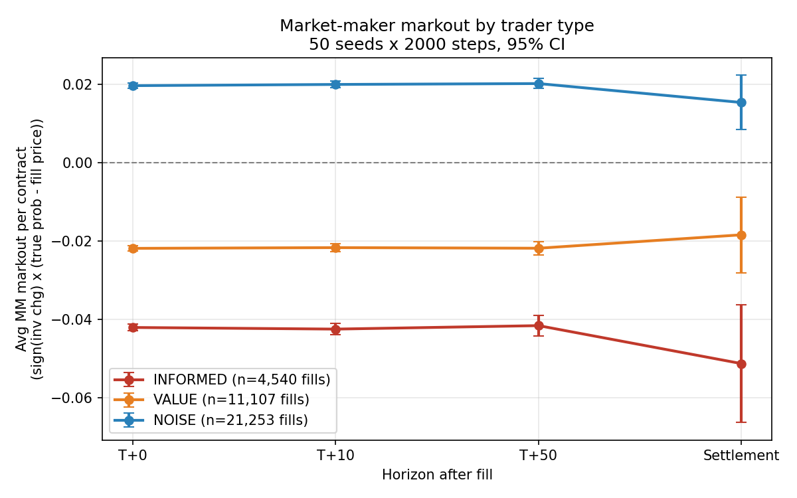
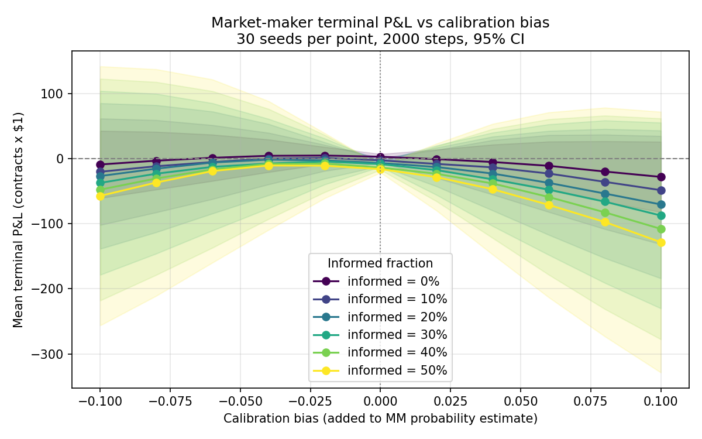
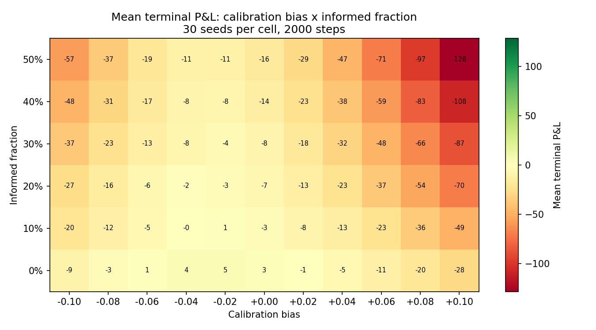
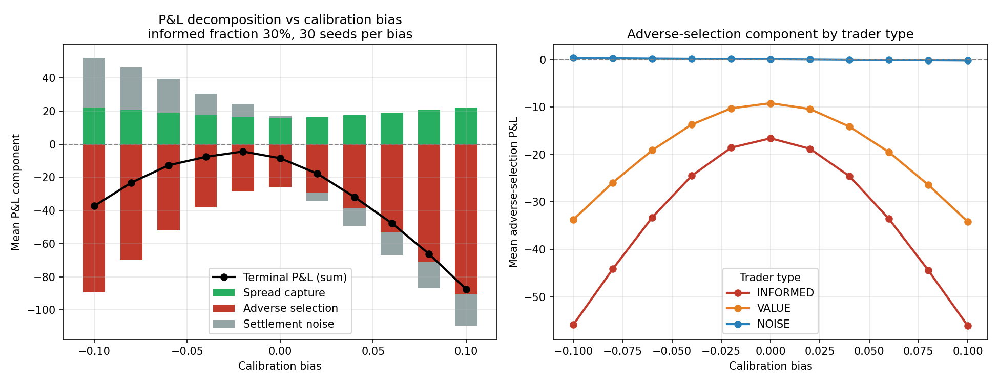
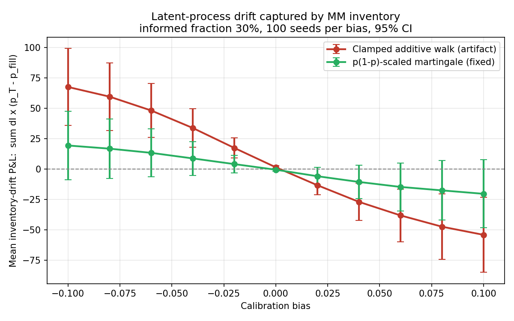
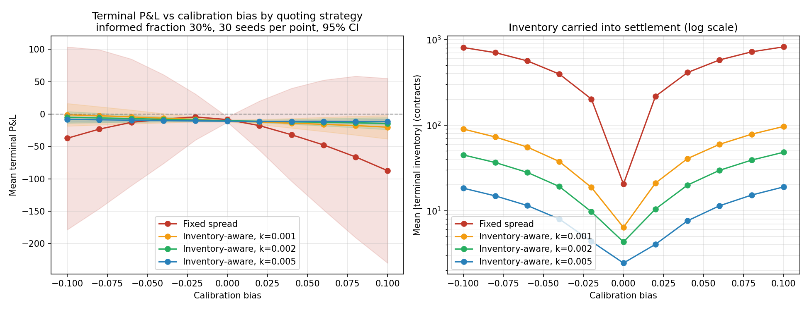

# EventEdge

**Informed flow amplifies the cost of calibration error**

EventEdge is a C++ simulator (with a Python experiment layer) for market making in binary event contracts — instruments that pay $1 if an event occurs and $0 otherwise, so price is implied probability. It studies one question:

> How does a market maker's probability-estimation error interact with informed order flow, and what does that cost?

The simulation core is C++ with no dependencies. Python (`pandas`/`matplotlib`) orchestrates parameter sweeps and analysis but reimplements no simulation logic.

## Main results

### 1. Markouts prove the adverse selection is real

For every fill, we track the true (latent) probability at T+0, T+10, T+50 steps and at settlement, and compute the market maker's markout per contract: `sign(inventory change) × (true prob − fill price)`.



Informed fills are systematically negative for the MM (−0.042, worsening to −0.051 at settlement); noise fills sit at exactly +0.020 — the half-spread — confirming they carry zero information. The informed loss is flat across horizons: informed traders here exploit *level* errors in the MM's estimate (already fully present at T+0), not future drift.

### 2. Calibration bias and informed flow interact multiplicatively

Sweeping calibration bias × informed participation (11 × 6 grid, 30 seeds per cell, 2,000 steps per run):




A +0.10 bias costs −28 with no informed flow but −128 at 50% informed: informed traders don't add a constant tax, they multiply the cost of being wrong, because they selectively hit exactly the quotes the bias mispriced. Even a perfectly calibrated MM loses once informed participation exceeds roughly 10–20% — the 0.04 spread stops covering adverse selection, the classic Glosten–Milgrom result.

### 3. An exact P&L decomposition separates the loss channels

Terminal P&L decomposes exactly (verified to 5e-12 against the C++ accounting on every run):

```
terminal_pnl = Σ over fills of  ΔI · (Y − p)
             = Σ ΔI·(mid − p)      spread capture
             + Σ ΔI·(p_true − mid) adverse selection
             + Σ ΔI·(Y − p_true)   settlement risk
```

where ΔI is the MM's signed inventory change, p the fill price, mid the quote midpoint, p_true the latent probability at fill time, and Y the 0/1 outcome.



Adverse selection is quadratic in bias and dominates; spread capture is nearly flat. Split by trader type, noise traders contribute ~0 adverse selection at every bias level — the cleanest internal validation of the model. One honest surprise: the "settlement noise" term is not mean-zero — the clamped random walk on [0.01, 0.99] is not a true martingale, and the induced drift interacts with the signed inventory the bias creates. This led to the martingale probability process below.

### 5. A martingale probability process removes the settlement-drift artifact

Splitting the settlement term once more, `Σ ΔI·(Y − p_fill) = Σ ΔI·(p_T − p_fill) + inv_T·(Y − p_T)`, isolates a drift component that is zero if and only if the latent process is a martingale. Under the default clamped additive walk it is significantly nonzero (>4σ at large bias — the clamp acts as a reflecting boundary). Replacing the process with state-dependent volatility, `Δp = σ·p(1−p)·Z` (`--prob-process martingale`), makes `p` a true martingale that lives in (0, 1) naturally — a pure logit-space walk would *not* do this, by Jensen's inequality:



Under the martingale process the drift component is statistically indistinguishable from zero at every bias (100 seeds per point), so the decomposition's settlement term becomes pure risk, as the theory says it should be.

### 4. Inventory-aware quoting flattens the loss surface

The decomposition shows a biased MM bleeds through mispriced quotes *and* through a large one-sided inventory carried into a binary settlement. Skewing the quote center against inventory (`center = estimate − k·inventory`) attacks the second channel:



| Bias | Fixed | k=0.001 | k=0.002 | k=0.005 |
|------|-------|---------|---------|---------|
| −0.10 | −37.3 | −1.0 | −5.0 | −8.3 |
| 0.00 | −8.5 | −10.4 | −10.3 | −10.9 |
| +0.10 | −87.5 | −20.2 | −14.5 | −11.7 |

The skew is insurance: it costs ~2 P&L at zero bias (quoting off-estimate gives up edge) but recovers 75–85% of the losses at ±0.10 bias, while cutting inventory carried into settlement by up to 40× and collapsing P&L variance. Intuitively, one-sided flow *is* information — accumulating longs means your quotes are too high — so the skew acts as a crude Bayesian update from order flow, in the spirit of Avellaneda–Stoikov.

## Model

**Latent probability.** A hidden true probability `p_true` evolves by one of two processes. Default (`--prob-process additive`): a Gaussian random walk (σ=0.01 per step) with occasional jumps (2% chance of a σ=0.05 shock), clamped to [0.01, 0.99] — simple, but the clamp induces drift near the bounds. Alternative (`--prob-process martingale`): `Δp = σ·p(1−p)·Z` with vol matched to the additive process at p=0.6 — a true martingale that stays in (0, 1) naturally (the safety clamp at 1e-6 binds only on rare boundary-hugging steps, where its P&L effect is ~1e-6). Clip counts are tracked in both cases. At the end of a run the event outcome is drawn `Y ~ Bernoulli(p_true(T))` and all open inventory settles at Y.

**Signals.** The MM observes a public signal `p_true + N(0, σ_pub)` (default σ_pub=0.05). Informed traders observe a private signal with σ_priv=0.02. Calibration bias is added to the MM's estimate: `mm_estimate = clamp(public_signal + bias)`.

**Traders.** Each step one trader may arrive: informed (probability = `informed_fraction`), value (0.20 — trades on its own public-signal draw), else noise. Informed and value traders trade only with edge beyond a 0.02 threshold past the quote, and may decline to trade; noise traders flip a fair coin and trade 30% of the time.

**Market maker.** Quotes `bid/ask = center ∓ base_spread/2` (default spread 0.04), where `center` is the estimate (FIXED_SPREAD) or the inventory-skewed estimate (INVENTORY_AWARE). Market orders fill at the quote.

## Conventions (do not break these)

Sides are from the **trader's** perspective: trader BUY fills at the ask and *decreases* MM inventory; trader SELL fills at the bid and increases it. Cash: `mm_cash −= fill_price × mm_inventory_change`. Wealth at time t is `cash + inventory × mark`; terminal P&L is `cash + inventory × Y − fees`. Cash alone is never P&L while inventory is open. All probabilities and quotes live in [0, 1] with `bid ≤ ask`.

## Build, test, run

```bash
mkdir -p build && cd build
cmake .. && cmake --build .
ctest --output-on-failure          # 19 test functions, ~21k assertions
./eventedge --seed 42 --steps 2000 --bias 0.05 --informed-fraction 0.3 \
            --mm-strategy inventory --inventory-aversion 0.002 \
            --out-prefix ../data/demo
```

The binary writes `<prefix>_summary.csv` (one row per run), plus `<prefix>_steps.csv` and `<prefix>_fills.csv` unless `--log-detail 0`. Output uses full double precision because the Python layer checks exact accounting identities against it.

Experiments (each regenerates its chart in `results/`):

```bash
python3 python/markout_analysis.py          # markouts by trader type
python3 python/run_experiments.py           # bias × informed-fraction sweep
python3 python/pnl_decomposition.py         # exact P&L decomposition
python3 python/inventory_aware_experiment.py # fixed vs inventory-aware
python3 python/settlement_drift_check.py    # martingale process validation
```

Every run is fully determined by `(seed, config)`; per-component RNG streams are derived from the base seed. Sweeps run 30 seeds per parameter point and report means with 95% CIs.

## Layout

```
include/, src/    C++ simulation core (probability process, traders, MM, matching)
tests/            dependency-free unit tests (run via ctest)
python/           experiment orchestration and analysis
data/             raw run output (generated)
results/          charts and aggregated CSVs (generated)
```

## Limitations

The matching model is a single MM quoting one price level with unit-size market orders — no order book depth, queues, latency, or competing liquidity providers. The default clamped additive walk is not a martingale near its bounds; the headline sweeps use it for continuity, and the martingale process (result 5) quantifies exactly how much of the settlement term the artifact explains. Markout confidence intervals treat fills as independent, but all fills within a seed share one settlement draw and one latent path, so settlement-horizon CIs are somewhat optimistic — the same shared-path correlation is why the drift check needs 100 seeds. The informed trader's edge threshold and the value/noise arrival rates are fixed constants rather than swept parameters.

## Extensions

Adverse-selection loss vs signal-quality gap; adaptive spreads (`ADAPTIVE_SPREAD` is stubbed); rerunning the headline sweeps under the martingale process; multiple competing MMs; limit orders and queue position; calibration-score vs profitability frontier across quoting policies.
