# EventEdge

**Informed flow amplifies the cost of calibration error**

EventEdge is a C++ simulator (with a Python experiment layer) for market making in binary event contracts — instruments that pay $1 if an event occurs and $0 otherwise, so price is implied probability. It studies one question:

> How does a market maker's probability-estimation error interact with informed order flow, and what does that cost?

The simulation core is C++ with no dependencies: ~5 million simulation steps per second per core (a 2,000,000-step run takes 0.36 s on a 2.1 GHz Xeon with logging off), and a run is fully determined by `(seed, config)` down to byte-identical CSV output. Python (`pandas`/`matplotlib`) orchestrates parameter sweeps and analysis but reimplements no simulation logic.

## Main results

### 1. Markouts prove the adverse selection is real

For every fill, we track the true (latent) probability at T+0, T+10, T+50 steps and at settlement, and compute the market maker's markout per contract: `sign(inventory change) × (true prob − fill price)`.

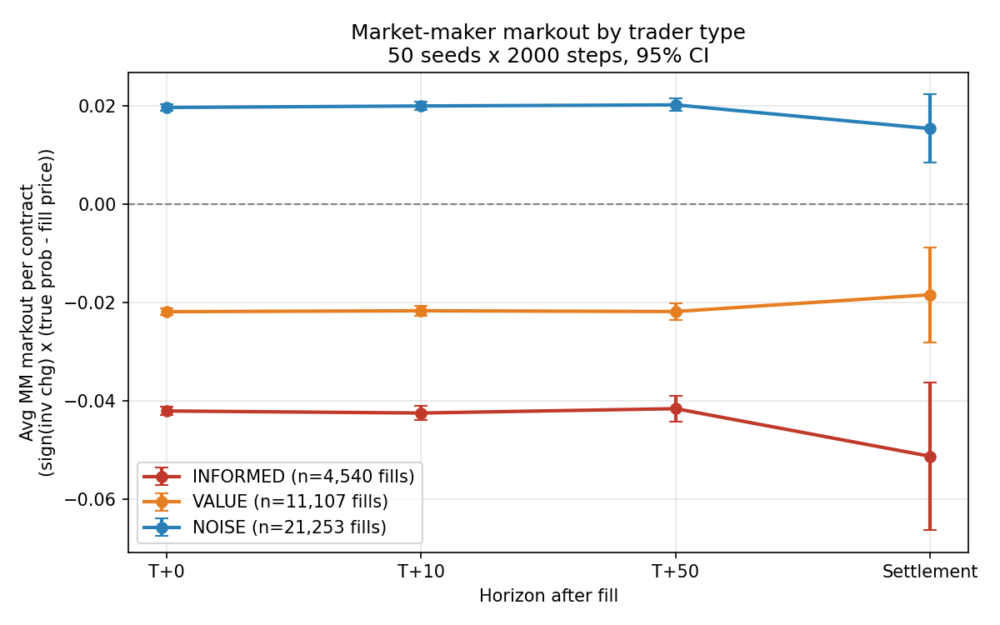

Informed fills are systematically negative for the MM (−0.042, worsening to −0.051 at settlement); noise fills sit at exactly +0.020 — the half-spread — confirming they carry zero information. The informed loss is flat across horizons: informed traders here exploit *level* errors in the MM's estimate (already fully present at T+0), not future drift.

### 2. Calibration bias and informed flow interact multiplicatively

Sweeping calibration bias × informed participation (11 × 6 grid, 2,000 steps per run). The corrected run uses the martingale process from p0 = 0.5, 200 seeds per cell, and inventory marked at the terminal probability (see **Settlement and P&L** below and result 6 for why each of those matters):

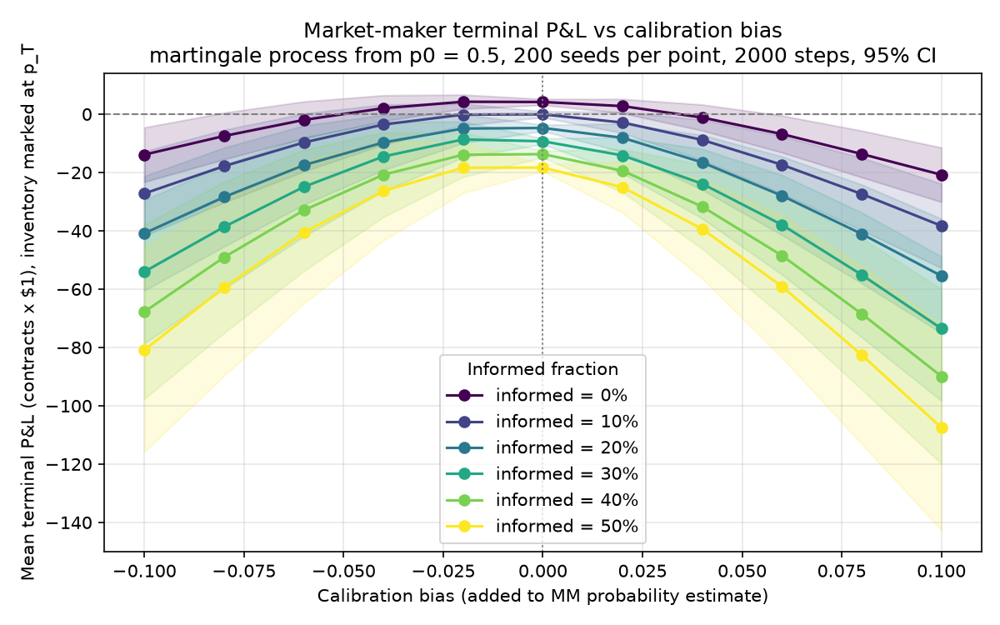
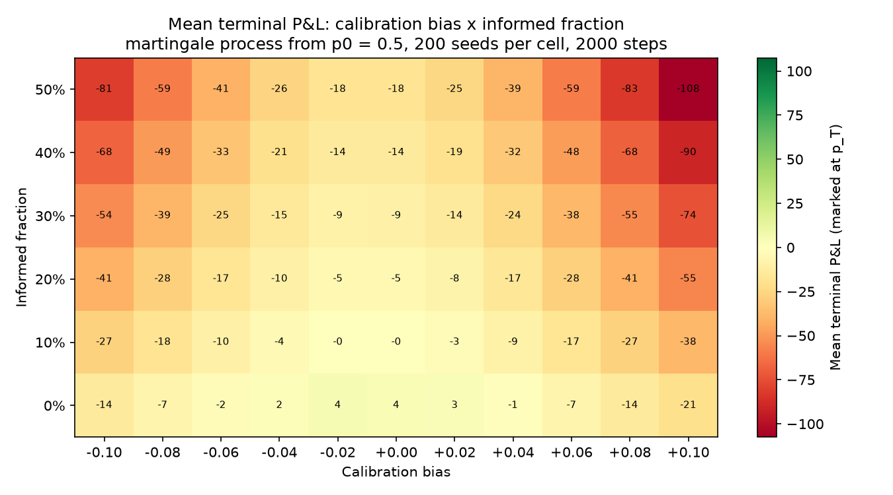

| informed | bias −0.10 | −0.04 | 0.00 | +0.04 | +0.10 |
|---|---|---|---|---|---|
| 0% | −14 ± 9 | +2 ± 4 | +4 ± 1 | −1 ± 4 | −21 ± 9 |
| 10% | −27 ± 15 | −4 ± 7 | 0 ± 1 | −9 ± 7 | −38 ± 14 |
| 30% | −54 ± 25 | −15 ± 12 | −9 ± 1 | −24 ± 12 | −74 ± 25 |
| 50% | −81 ± 35 | −26 ± 17 | −18 ± 1 | −39 ± 17 | −108 ± 35 |

A 0.10 bias costs about −20 with no informed flow but −75 to −110 at 30–50% informed: informed traders don't add a constant tax, they multiply the cost of being wrong, because they selectively hit exactly the quotes the bias mispriced. Even a perfectly calibrated MM loses once informed participation exceeds roughly 10% — the 0.04 spread stops covering adverse selection, the classic Glosten–Milgrom result. The surface is symmetric in the sign of the bias to within its confidence intervals.

The original version of this sweep (clamped additive walk from p0 = 0.6, 30 seeds, settled P&L; `results/pnl_vs_calibration_bias.png`, `results/heatmap_bias_x_informed.png`) gave the same shape with larger magnitudes (−28 / −128) and an apparent asymmetry between the signs of the bias. Result 6 shows that asymmetry was a settlement artifact plus 30-seed noise; the multiplicative interaction survives the correction.

### 3. An exact P&L decomposition separates the loss channels

Terminal P&L decomposes exactly (verified to 5e-12 against the C++ accounting on every run):

```
terminal_pnl = Σ over fills of  ΔI · (Y − p)
             = Σ ΔI·(mid − p)      spread capture
             + Σ ΔI·(p_true − mid) adverse selection
             + Σ ΔI·(Y − p_true)   settlement risk
```

where ΔI is the MM's signed inventory change, p the fill price, mid the quote midpoint, p_true the latent probability at fill time, and Y the 0/1 outcome.

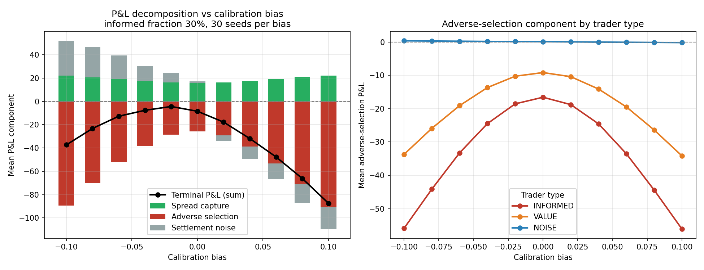

Adverse selection is quadratic in bias and dominates; spread capture is nearly flat. Split by trader type, noise traders contribute ~0 adverse selection at every bias level — the cleanest internal validation of the model. One honest surprise: the "settlement noise" term is not mean-zero — the clamped random walk on [0.01, 0.99] is not a true martingale, and the induced drift interacts with the signed inventory the bias creates. This led to the martingale probability process in result 4.

### 4. A martingale probability process removes the settlement-drift artifact

Splitting the settlement term once more, `Σ ΔI·(Y − p_fill) = Σ ΔI·(p_T − p_fill) + inv_T·(Y − p_T)`, isolates a drift component that is zero if and only if the latent process is a martingale. Under the default clamped additive walk it is significantly nonzero (>4σ at large bias — the clamp acts as a reflecting boundary). Replacing the process with state-dependent volatility, `Δp = σ·p(1−p)·Z` (`--prob-process martingale`), makes `p` a true martingale that lives in (0, 1) naturally — a pure logit-space walk would *not* do this, by Jensen's inequality:

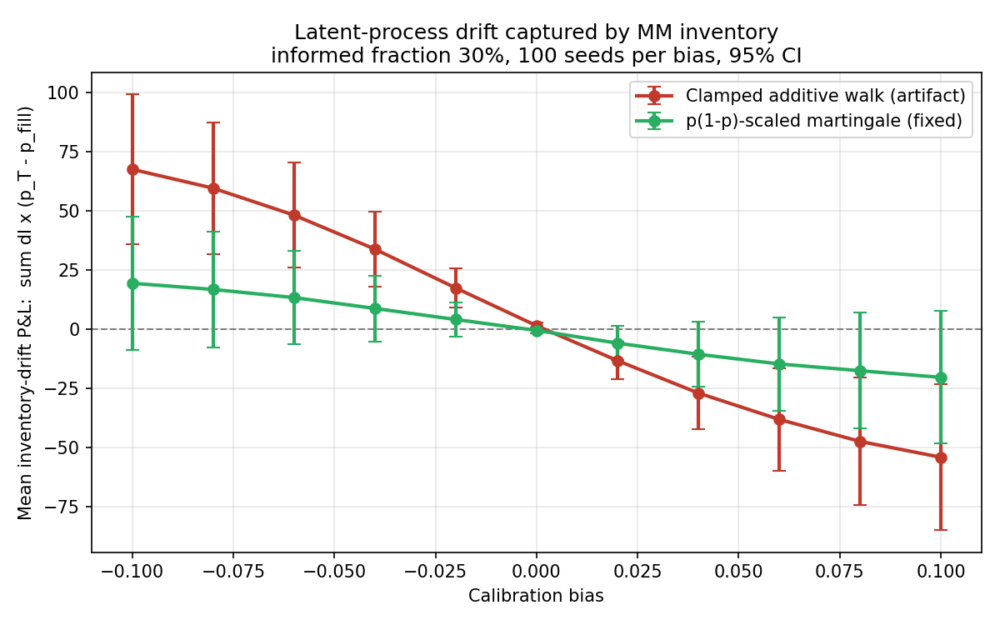

Under the martingale process the drift component is statistically indistinguishable from zero at every bias (100 seeds per point), so the decomposition's settlement term becomes pure risk, as the theory says it should be.

### 5. Inventory-aware quoting flattens the loss surface

The decomposition shows a biased MM bleeds through mispriced quotes *and* through a large one-sided inventory carried into a binary settlement. Skewing the quote center against inventory (`center = estimate − k·inventory`) attacks the second channel:

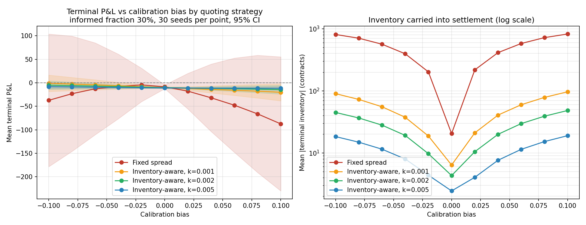

| Bias | Fixed | k=0.001 | k=0.002 | k=0.005 |
|------|-------|---------|---------|---------|
| −0.10 | −37.3 | −1.0 | −5.0 | −8.3 |
| 0.00 | −8.5 | −10.4 | −10.3 | −10.9 |
| +0.10 | −87.5 | −20.2 | −14.5 | −11.7 |

The skew is insurance: it costs ~2 P&L at zero bias (quoting off-estimate gives up edge) but recovers 75–85% of the losses at ±0.10 bias, while cutting inventory carried into settlement by up to 40× and collapsing P&L variance. Intuitively, one-sided flow *is* information — accumulating longs means your quotes are too high — so the skew acts as a crude Bayesian update from order flow, in the spirit of Avellaneda–Stoikov.

### 6. The bias asymmetry is a settlement artifact, not a market-making effect

In the headline sweep a −0.10 bias cost −37 and +0.10 cost −88. Three candidate explanations: (H1) the payoff is bounded, so from p0 = 0.6 the two signs of bias hit the clamps differently; (H2) the clamped walk is not a martingale — it drifts toward 0.5 from p0 = 0.6, and a +bias MM's long inventory sits on the wrong side of that drift; (H3) sampling noise. A survivorship story cannot apply here: every run settles and nothing is conditioned on the outcome. The test is the symmetric design: p0 ∈ {0.4, 0.5, 0.6} × {additive, martingale} × bias ±{0.02…0.10}, 600 seeds per point, with the asymmetry A(b) = X(+b) − X(−b) computed per channel of the exact decomposition (`python/asymmetry_experiment.py`).

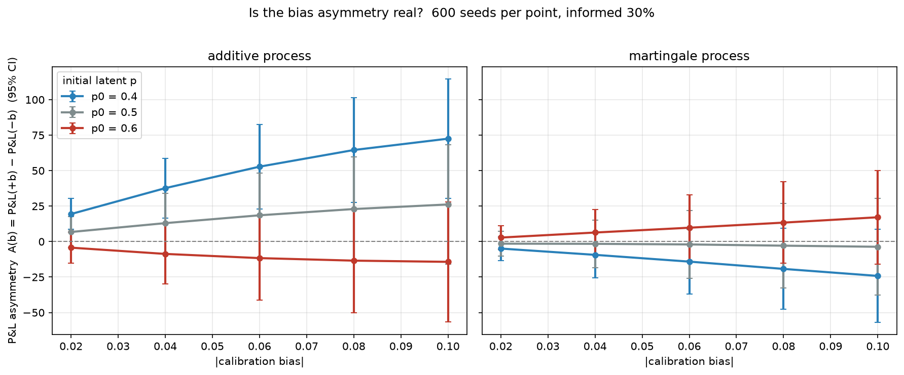
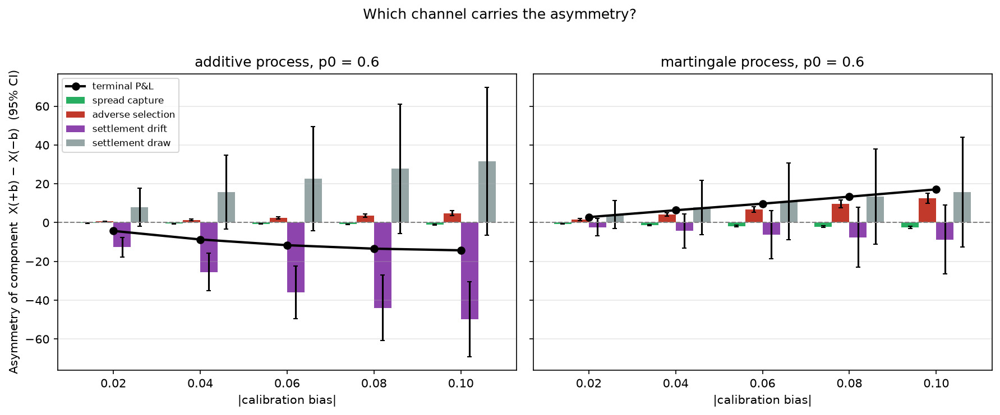

At |bias| = 0.10, 30% informed:

| process | p0 | total P&L | spread | adverse selection | settlement drift | settlement draw |
|---|---|---|---|---|---|---|
| additive | 0.4 | +72 ± 42 | +1.0 (z 7.5) | −4.2 (z −6.9) | **+54 ± 19 (z 5.5)** | +22 ± 40 |
| additive | 0.5 | +26 ± 43 | 0.0 | +0.5 | +2 ± 18 (z 0.2) | +24 ± 40 |
| additive | 0.6 | −14 ± 40 | −1.0 (z −7.6) | +4.9 (z 7.8) | **−50 ± 19 (z −5.1)** | +32 ± 40 |
| martingale | 0.4 | −24 ± 34 | +2.5 (z 9.8) | −12.4 (z −9.5) | −13 ± 18 (z −1.4) | −1 ± 29 |
| martingale | 0.5 | −4 ± 30 | +0.1 | −0.1 | −11 ± 18 (z −1.2) | +7 ± 29 |
| martingale | 0.6 | +17 ± 33 | −2.4 (z −9.6) | +12.6 (z 9.7) | −9 ± 18 (z −1.0) | +16 ± 29 |

Conclusion: **H2.** The only channel with a large, significant asymmetry is the settlement drift `Σ ΔI·(p_T − p_t)`, it flips sign between p0 = 0.6 and 0.4, it is zero at p0 = 0.5, and it is indistinguishable from zero under the martingale process at every p0. H1 is real but small: the spread and adverse-selection channels carry a few units each with opposite signs (highly significant, they flip with p0, and they roughly cancel), and they are larger under the martingale because its volatility scales with p(1−p), so an informed trader's edge is level-dependent. The rest of the original gap was H3: with 30 seeds the settlement draw alone has a standard error of ~70 per point, and the draws are *shared across the bias grid* (every cell reuses the same seeds and the settlement RNG), so a whole table tilts coherently. That observation is what motivated the corrected framework in result 2.

### 7. Fees turn a marginal market maker into a losing one, and a fill is worse news than an order

Kalshi charges `fee_rate × C × P × (1−P)` per fill, rounded up to the next cent: 7% for takers, 1.75% for makers on the series that charge makers at all. At p = 0.5 the taker fee is 1.75¢ per contract, the same order as the 2¢ half-spread this MM earns. (`python/fees_and_fills.py`; rates are from Kalshi's published schedule as of 2025 and are a flag, `--fee-rate`, not a constant.)

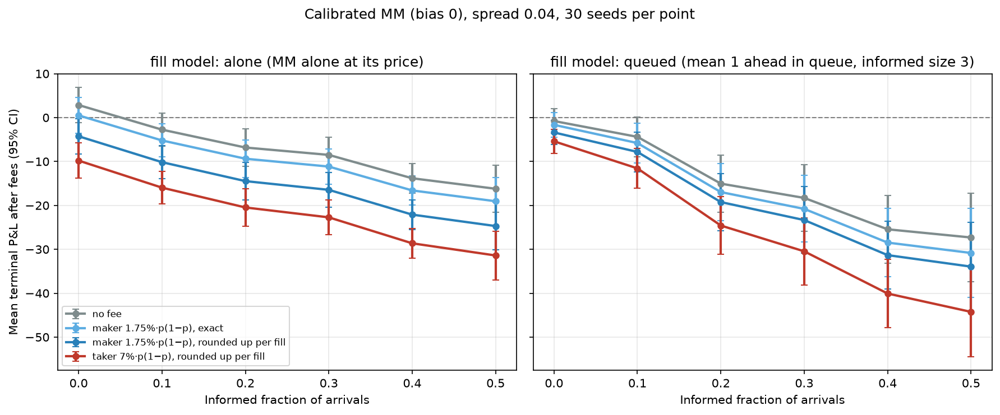

Calibrated MM (bias 0), fixed 0.04 spread, mean terminal P&L over 30 seeds:

| | 0% informed | 10% | 30% | 50% |
|---|---|---|---|---|
| no fee | +2.9 | −2.7 | −8.5 | −16.2 |
| maker 1.75%, exact | +0.5 | −5.2 | −11.2 | −19.1 |
| maker 1.75%, rounded up per fill | −4.3 | −10.2 | −16.5 | −24.7 |
| taker 7%, rounded up per fill | −9.8 | −16.0 | −22.7 | −31.4 |

Pre-fee, the MM is profitable up to roughly 5% informed flow. After the maker fee it is not profitable at any informed fraction, and the rounding rule matters more than the rate: at unit size a 0.42¢ fee becomes 1¢, three times the exact charge and half of the half-spread.

The second friction is queue position. With a mean of one contract queued ahead of the MM at its price (Poisson per order) and informed traders sending 3-contract orders, a unit noise order is absorbed 63% of the time while an informed sweep still reaches the MM. At 30% informed *arrivals*, informed *fills* rise from 34% to 57% of the MM's fills, the fill count drops from 796 to 441, and the loss per fill more than doubles (−8.5 → −18.3 in total). Conditional on being filled, the counterparty is informed: the fill itself is the adverse event.

### 8. Glosten–Milgrom quoting beats the fixed spread with a narrower spread

Prediction-market making is the textbook Glosten–Milgrom (1985) setting: a binary value, informed and noise traders, a risk-neutral MM. `--mm-strategy gm` implements it: a posterior over the latent probability on a 199-point grid, diffused each step by the process the quoter assumes, updated by its (bias-shifted) public signal and by every order it sees — a quiet step is evidence too — and quotes at the regret-free prices `ask = E[p | a buy arrives at ask]`, `bid = E[p | a sell arrives at bid]` under the trader population the simulator actually implements. Its spread is endogenous.

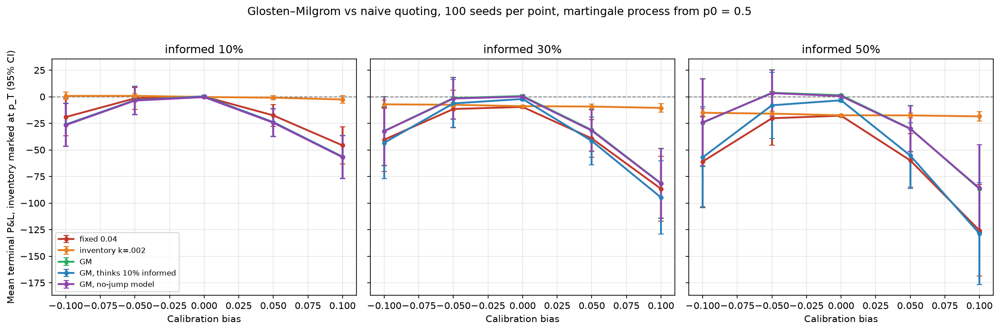

Martingale process from p0 = 0.5, inventory marked at p_T, 100 seeds per point. Mean terminal P&L at zero calibration bias, and the realised spread each quoter posted:

| quoter | 10% informed | 30% | 50% | spread at 10 / 30 / 50% |
|---|---|---|---|---|
| fixed 0.04 | +0.2 ± 1.0 | −9.6 ± 1.5 | −17.9 ± 1.9 | 0.039 |
| inventory-aware k = 0.002 | −0.3 | −8.9 | −17.5 | 0.040 |
| **Glosten–Milgrom** | **+0.2** | **+0.7** | **+1.4** | 0.012 / 0.020 / 0.028 |
| GM told 10% informed | +0.2 | −2.1 | −3.4 | 0.012 |
| GM with a no-jump process model | −0.4 | +0.1 | +0.6 | 0.010 / 0.017 / 0.024 |

Three things to read off. First, the GM quoter breaks even (as the regret-free condition says it should) at every informed fraction where the fixed spread loses 10–18, and it does so with a spread one-half to one-third as wide, because its quotes move with the flow: a buy raises its posterior before the next informed buyer arrives, so the second informed trade finds less edge. Second, misspecifying the population costs money exactly where GM theory says it should: told there are 10% informed when there are 50%, it quotes a 1.2¢ spread against a 2.8¢ adverse-selection cost and turns break-even into −3.4, and at +0.10 bias it loses −129 against the well-specified −87. Third, the process model barely matters: dropping the jump term from the quoter's kernel changes P&L by under 1, because the public signal (σ = 0.05) re-anchors the posterior every step and the one-step diffusion (σ = 0.01) is small beside it — the jump risk is priced through the signal, not the prior. Calibration bias hurts GM about as much as the naive quoter (it enters through the signal, and a Bayesian trusts its signal): at ±0.10 bias GM loses −24 to −87 against the fixed quoter's −18 to −86. The theory-optimal quoter fixes the spread problem, not the calibration problem. The residual −0.10 vs +0.10 gap in this table (100 shared seeds, CI ≈ ±20) is the shared-path noise discussed in result 6, not a mechanism.

### 9. Stale quotes: the cost of latency is linear in the delay, and it is all in the jump windows

`--quote-latency L` makes the MM quote off the public signal from L steps ago. Jumps in the latent path (|Δp| > 0.03, 26 per 2,000-step run) leave the quote stale for L steps, and the adverse-selection term of each fill is attributed to the window after a jump or to the background (`python/latency_sniping.py`).

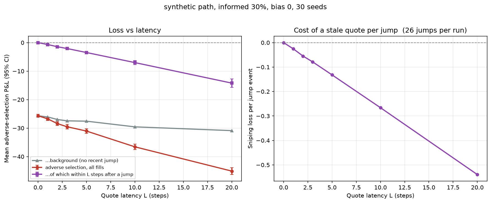

| latency L | 0 | 1 | 2 | 5 | 10 | 20 |
|---|---|---|---|---|---|---|
| adverse selection, all fills | −25.7 | −26.8 | −28.4 | −31.0 | −36.6 | −45.1 |
| …within L steps after a jump | 0 | −0.7 | −1.4 | −3.5 | −7.0 | −14.2 |
| …background | −25.7 | −26.1 | −27.0 | −27.6 | −29.6 | −30.9 |
| loss per jump event | 0 | −0.03 | −0.05 | −0.13 | −0.27 | −0.54 |

The sniping loss grows linearly at about 0.027 per step of latency per jump, and inside the stale windows 41% of fills are informed against 34% overall. The background also creeps up with L because a slow quoter is also slow to follow the diffusion, not just the jumps. The same script takes `--prob-path` to run on a Kalshi path, where the jump timestamps are the market's own.


## Model

**Latent probability.** A hidden true probability `p_true` evolves by one of two synthetic processes, or replays a real Kalshi price path (`--prob-path`, see below). Default (`--prob-process additive`): a Gaussian random walk (σ=0.01 per step) with occasional jumps (2% chance of a σ=0.05 shock), clamped to [0.01, 0.99] — simple, but the clamp induces drift near the bounds. Alternative (`--prob-process martingale`): `Δp = σ·p(1−p)·Z` with vol matched to the additive process at p=0.6 — a true martingale that stays in (0, 1) naturally (the safety clamp at 1e-6 binds only on rare boundary-hugging steps, where its P&L effect is ~1e-6). Clip counts are tracked in both cases. At the end of a run the event outcome is drawn `Y ~ Bernoulli(p_true(T))` and all open inventory settles at Y.

**Signals.** The MM observes a public signal `p_true + N(0, σ_pub)` (default σ_pub=0.05). Informed traders observe a private signal with σ_priv=0.02. Calibration bias is added to the MM's estimate: `mm_estimate = clamp(public_signal + bias)`.

**Traders.** Each step one trader may arrive: informed (probability = `informed_fraction`), value (0.20 — trades on its own public-signal draw), else noise. Informed and value traders trade only with edge beyond a 0.02 threshold past the quote, and may decline to trade; noise traders flip a fair coin and trade 30% of the time.

**Market maker.** Quotes `bid/ask = center ∓ base_spread/2` (default spread 0.04), where `center` is the estimate (FIXED_SPREAD) or the inventory-skewed estimate (INVENTORY_AWARE); or the Glosten–Milgrom regret-free prices (`--mm-strategy gm`, result 8). With `--quote-latency L` the quote uses the public signal from L steps ago.

**Fills and fees.** Market orders fill at the quote. With `--queue-ahead Q`, a Poisson(Q) number of contracts from other liquidity providers sits ahead of the MM and takes the first contracts of every order; informed orders are `--informed-size` contracts (default 1). Fees are `--fee-rate × p(1−p)` per contract at the fill price, rounded up to the cent per fill (`--fee-round-cents 0` for exact), plus the flat `transaction_cost`; all default to zero.

**Settlement and P&L.** The summary carries both the settled P&L (`cash + inventory·Y − fees`) and `terminal_pnl_marked = cash + inventory·p_T − fees`. Since `Y ~ Bernoulli(p_T)` independently of the path, the marked value is exactly `E[settled P&L | path, fills]`: an unbiased estimator of expected P&L without the one Bernoulli draw per run that otherwise dominates the variance (and is shared across a sweep, because every cell reuses the same seeds). Sweeps from result 2 onward report the marked value; the replay of a settled Kalshi market reports the real settlement.

## Conventions (do not break these)

Sides are from the **trader's** perspective: trader BUY fills at the ask and *decreases* MM inventory; trader SELL fills at the bid and increases it. Cash: `mm_cash −= fill_price × mm_inventory_change`. Wealth at time t is `cash + inventory × mark`; terminal P&L is `cash + inventory × Y − fees`. Cash alone is never P&L while inventory is open. All probabilities and quotes live in [0, 1] with `bid ≤ ask`.

## Build, test, run

```bash
mkdir -p build && cd build
cmake .. && cmake --build .
ctest --output-on-failure          # 19 test functions, ~21k assertions
./eventedge --seed 42 --steps 2000 --bias 0.05 --informed-fraction 0.3 \
            --mm-strategy inventory --inventory-aversion 0.002 \
            --out-prefix ../data/demo
```

The binary writes `<prefix>_summary.csv` (one row per run), plus `<prefix>_steps.csv` and `<prefix>_fills.csv` unless `--log-detail 0`. Output uses full double precision because the Python layer checks exact accounting identities against it.

Experiments (each regenerates its chart in `results/`):

```bash
python3 python/markout_analysis.py          # markouts by trader type
python3 python/run_experiments.py           # bias × informed-fraction sweep
python3 python/pnl_decomposition.py         # exact P&L decomposition
python3 python/inventory_aware_experiment.py # fixed vs inventory-aware
python3 python/settlement_drift_check.py    # martingale process validation
python3 python/run_experiments.py --prob-process martingale --p0 0.5 --seeds 200 --pnl marked
                                            # corrected headline sweep (result 2)
python3 python/asymmetry_experiment.py      # symmetric design, 600 seeds (result 6)
python3 python/fees_and_fills.py            # Kalshi fees x queue position (result 7)
python3 python/gm_benchmark.py              # Glosten-Milgrom vs naive quoting (result 8)
python3 python/latency_sniping.py           # stale-quote sniping vs latency (result 9)
```

New flags since the original experiments: `--p0`, `--fee-rate`, `--fee-round-cents`, `--queue-ahead`, `--informed-size`, `--quote-latency`, `--mm-strategy gm` with `--gm-vol`, `--gm-jump-prob`, `--gm-jump-vol`, `--gm-informed`, `--gm-markup`, and the replay flags `--prob-path` / `--outcome`. Every one defaults to the original behaviour; the original runs reproduce byte-for-byte.

Every run is fully determined by `(seed, config)`; per-component RNG streams are derived from the base seed. Sweeps run 30 seeds per parameter point and report means with 95% CIs.

## Real data: Kalshi replay

The latent probability can be a real market instead of a synthetic process. `python/kalshi.py` pulls a binary contract's price history from Kalshi's public trade API (unauthenticated GET endpoints only: markets, trades, candlesticks; nothing is placed or sent) and writes a replay path; the binary consumes it with `--prob-path`, and a settled market's real result replaces the settlement draw with `--outcome yes|no`.

```bash
python3 python/kalshi.py list --series KXBTCD --status settled        # find tickers
python3 python/kalshi.py fetch --ticker KXBTCD-25SEP2717-T115999.99 --interval 1
#   -> data/kalshi/<ticker>_path.csv, <ticker>_meta.json, raw JSON under data/kalshi/raw/
python3 python/kalshi.py stats                                        # path vol / jump rate vs the synthetic defaults
./eventedge --prob-path data/kalshi/<ticker>_path.csv --outcome yes --bias 0.05 --out-prefix data/demo_replay
python3 python/kalshi_replay.py                                       # bias sweep on every fetched market
```

A path is one row per simulator step (`time_step,timestamp,latent_probability`): 1-minute candles give 1440 steps a day, hourly candles ~720 a month. Candles use the period's last trade, else the bid/ask midpoint, forward-filled; `--source trades` resamples raw trades onto the grid instead. `--steps` defaults to the path length and may not exceed it. Seeds still vary the signals and trader arrivals, so 30 seeds on one path measure adverse selection against that path; the path itself never changes. Two things to keep in mind when reading replay results:

- With `--outcome yes|no` every seed settles the same way, so a single market's P&L-vs-bias curve is dominated by which side the MM's inventory ended on. Compare across many settled markets, or use `--outcome draw` to isolate the quoting channels.
- Kalshi prices are 1–99 cents, so the [0.01, 0.99] clamp never binds on real data; `kalshi.py stats` reports the per-step vol and jump rate so the synthetic processes (σ 0.01, jumps 2%) can be calibrated to real markets rather than guessed.

**Empirical calibration curve.** `python/kalshi_calibration.py --series KXBTCD KXETHD` pulls every settled market in the given series, samples the traded price at 720 / 168 / 24 / 6 / 1 hours before expiry, and bins price against the realised YES frequency (Wilson 95% CI), stratified by series and by time-to-expiry band. The per-stratum mean and standard deviation of `frequency − price` (`results/kalshi_bias_distribution.csv`) are the measured replacement for the free `--bias` parameter. All settled markets are used whatever their result, so nothing is conditioned on the outcome; the only selection is a volume floor. Not yet run: this environment cannot reach `api.elections.kalshi.com`, so the script is tested against a local fake of the API and awaits a machine with access.

The summary CSV gains columns `outcome_source` (`draw`/`forced`), `prob_path` and `terminal_pnl_marked`. Tests: `tests/test_kalshi.py` (normalisation on recorded response shapes, pagination/retry against a local fake server, and the replay round trip through the binary; registered with ctest).

## Layout

```
include/, src/    C++ simulation core (probability process, traders, MM, matching)
tests/            dependency-free unit tests (run via ctest)
python/           experiment orchestration and analysis; kalshi.py is the data layer
data/             raw run output and fetched Kalshi paths (generated)
results/          charts and aggregated CSVs (generated)
```

## Limitations

The matching model is a single MM quoting one price level; the queue-ahead model stands in for competing liquidity providers with a Poisson depth rather than a real book, and latency is a fixed delay, not a distribution. The clamped additive walk is not a martingale near its bounds; results 1, 3 and 5 still use it (with the settlement-draw noise that implies), while results 2 and 6–9 use the martingale process from p0 = 0.5 and marked P&L. The Glosten–Milgrom quoter assumes the trader population's parameters (informed fraction, signal noises, edge threshold) rather than learning them; the misspecification runs in result 8 show what that costs. Fee rates are Kalshi's published schedule as of 2025 and should be re-checked against the current one. Nothing has yet been run on real Kalshi data from this environment (network policy); the replay, calibration and latency scripts are tested against a local fake of the API and synthetic paths. Markout confidence intervals treat fills as independent, but all fills within a seed share one settlement draw and one latent path, so settlement-horizon CIs are somewhat optimistic — the same shared-path correlation is why the drift check needs 100 seeds. The informed trader's edge threshold and the value/noise arrival rates are fixed constants rather than swept parameters.

## Extensions

Run the calibration curve and the replay benchmarks on real Kalshi data (needs network access to `api.elections.kalshi.com`); a GM quoter that learns the informed fraction from its own fill markouts; adverse-selection loss vs signal-quality gap; adaptive spreads (`ADAPTIVE_SPREAD` is stubbed); multiple competing MMs with a real queue; calibration-score vs profitability frontier across quoting policies.
