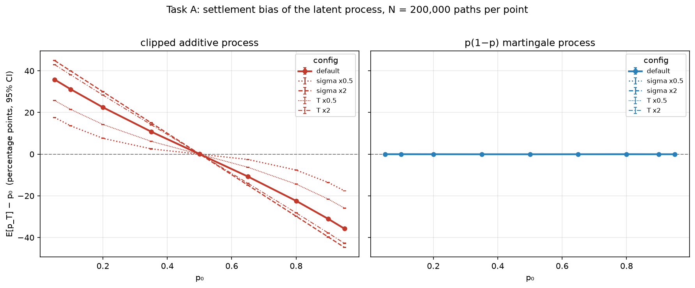
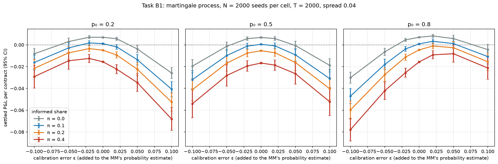
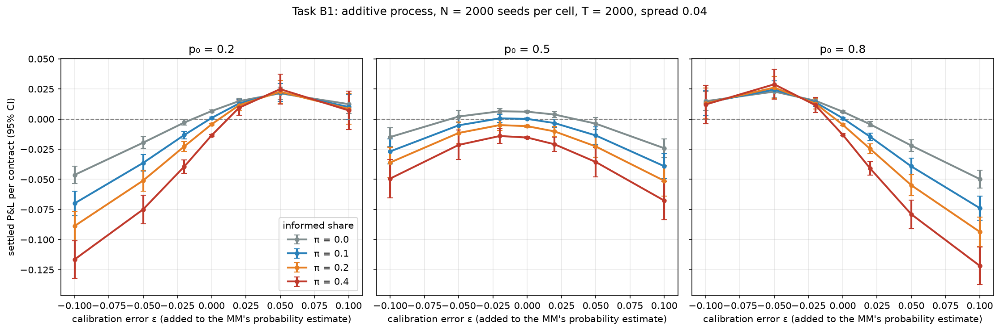

# EventEdge — results log

Working notes for Tasks A–C. Every number carries N, σ, horizon, spread and a
standard error. Scripts that reproduce each figure live under `experiments/`
and are run from the repo root after `cmake --build build`.

## 0. Definitions as implemented (read before running anything)

All line numbers refer to the branch head at the time of writing.

**(1) How ε enters.** Additively in probability, then clamped:
`estimated_prob_ = clamp_probability(public_signal + config_.calibration_bias)`
(`src/market_maker.cpp:68`), with `clamp_probability(x) = std::clamp(x, 0.01, 0.99)`
(`src/market_maker.cpp:9`). The public signal is itself `clamp(p_t + N(0, 0.05))`
(`src/event_probability.cpp:90-93`). Quotes are
`bid = clamp(center − spread/2)`, `ask = clamp(center + spread/2)`
(`src/market_maker.cpp:85-86`), so **yes, quotes are clipped — at [0.01, 0.99], not
[0, 1]**. With spread 0.04 the bid clips whenever `center < 0.03` and the ask
whenever `center > 0.97`. The clip is symmetric under p → 1−p.

**(2) What informed traders know.** Neither the terminal outcome nor the next
move: the *current* latent level plus small noise,
`private_signal = clamp(p_t + N(0, σ_priv = 0.02))` (`src/event_probability.cpp:95-98`),
drawn at the same step the order is placed (`src/main.cpp`, step 3 of the loop). An
informed trader buys iff `private_signal − ask > 0.02` and sells iff
`bid − private_signal > 0.02` (`src/trader_agents.cpp:81-87`, `kMinEdge = 0.02` in
`include/types.hpp`), otherwise declines. Value traders (20% of arrivals) do the same
with an independent public-signal draw (σ = 0.05); noise traders (the remainder) trade
with probability 0.30 on a fair coin. There is no "next-move" or "terminal-outcome"
information mode in the code, so B2(e) cannot be run without adding one.

**(3) Settlement.** Bernoulli at the horizon, not absorbing:
`std::bernoulli_distribution outcome_dist(terminal_prob); event_outcome = outcome_dist(settlement_rng)`
(`src/main.cpp:364-367`) with `terminal_prob = p_T` after the last step; the path is
never absorbed at 0/1 (it cannot reach them: see the clamps below). A replayed Kalshi
market can force the outcome with `--outcome yes|no`. The settlement RNG is its own
stream (`seed*3+3`, `src/main.cpp:265`).

**(4) P&L decomposition and markout horizon.** Exact per-fill identity
(`python/pnl_decomposition.py`): with ΔI the MM's signed inventory change, `p` the fill
price, `mid` the quote midpoint at the fill, `p_t` the latent probability at the fill,
`Y` the outcome,
`terminal_pnl = Σ ΔI(mid − p)` [spread capture] `+ Σ ΔI(p_t − mid)` [adverse selection]
`+ Σ ΔI(Y − p_t)` [settlement]. The settlement term is further split
(`python/settlement_drift_check.py`) into `Σ ΔI(p_T − p_t)` [process drift, zero in
expectation iff the latent process is a martingale] and `I_T(Y − p_T)` [the settlement
draw, mean-zero by construction]. Fees are subtracted from terminal P&L and are zero
at defaults. Markouts (`python/markout_analysis.py:36`): `sign(ΔI) × (p_{t+h} − fill price)`
at **h ∈ {0, 10, 50} steps and at settlement** (`Y − fill price`). The summary also
carries `terminal_pnl_marked = cash + I_T·p_T − fees` = `E[terminal_pnl | path, fills]`.

**(5) Old clipped process.** Still present and still the **default**:
`--prob-process additive` is `ProbProcess::CLAMPED_ADDITIVE` (`include/types.hpp`),
`Δp = N(0, 0.01) + 1{U < 0.02}·N(0, 0.05)`, then `clamp(·, 0.01, 0.99)`
(`src/event_probability.cpp:33-40, 73-79`). The new process is
`--prob-process martingale` = `ProbProcess::LOGISTIC_MARTINGALE`:
`Δp = 0.042·p(1−p)·Z + 1{U < 0.02}·0.21·p(1−p)·Z'`, then a numerical safety clamp to
`[1e-6, 1 − 1e-6]` (`src/event_probability.cpp:14-15, 22-24, 67-72`). Both keep a
`clip_count`. Neither is modified here. Note the new process is not the pure diffusion
`dp = σ p(1−p) dW` of the task description: it has the same 2%-per-step jump mixture as
the old one, scaled by p(1−p). Defaults used throughout unless stated: horizon
T = 2000 steps, spread 0.04, σ_pub = 0.05, σ_priv = 0.02, informed share π = 0.10,
p₀ = 0.6 (overridden by `--p0`).

**Common random numbers.** Per-component streams derive from the seed
(`src/main.cpp:250-265`): latent process and signals `seed·3+1`, trader arrivals
`seed·3+2`, settlement `seed·3+3`. Per step the process stream is consumed by exactly
one `step()` and three signal draws, and the trader stream by one type draw plus two
noise-trader draws when a noise trader arrives — none of which depends on ε or on the
quotes. Verified on seed 11, p₀ = 0.2, π = 0.2, martingale, ε ∈ {−0.05, 0, +0.05}:
the 2000-step latent path, the terminal probability, the settlement outcome and the
370 noise-trader fills (step and side) are identical across ε. Informed and value
decisions depend on the quotes, as they must. Across the two *processes* the trader
and settlement streams are shared but the latent path differs by construction.

## 1. Pilot and choice of N

`experiments/pilot.py`: 50 seeds per cell on both processes, p₀ ∈ {0.2, 0.5, 0.8},
ε ∈ {−0.10, −0.02, 0, +0.02, +0.10}, π ∈ {0, 0.1, 0.4}, T = 2000, spread 0.04. Full
table in `results/pilot.md`. Per-run SD of P&L per contract at p₀ = 0.5:

| process | cell | SD settled P&L/contract | SD marked P&L/contract |
|---|---|---|---|
| martingale | ε = 0, π = 0.1 | 0.013 | 0.009 |
| martingale | ε = ±0.10, π = 0.1 | 0.18–0.19 | 0.10 |
| martingale | ε = ±0.10, π = 0.4 | 0.28–0.29 | 0.15 |
| additive | ε = ±0.10, π = 0.4 | 0.39 | 0.15 |

The SD grows with |ε| because a biased MM carries hundreds of contracts to settlement
and the P&L is then `inventory × (Y − average fill price)`: the settlement draw and the
path's net move dominate. Marking inventory at p_T removes the draw (exactly, it is
`E[settled | path]`) and roughly halves the SD; the path-move term remains.

N per cell needed for SE(mean P&L/contract) ≤ 5% of the effect (pooled SD over the
pilot cells of each process, settled / marked):

| effect (p₀ = 0.5) | size, martingale | N needed | size, additive | N needed |
|---|---|---|---|---|
| ε = ±0.02 vs 0 at π = 0.1 | −0.0010 / −0.0022 | 5.3 M / 380 k | −0.0011 / −0.0016 | 10.6 M / 910 k |
| ε = ±0.10 vs 0 at π = 0.1 | −0.032 / −0.033 | 5,200 / 1,600 | −0.033 / −0.035 | 12,900 / 2,000 |
| π = 0.4 vs 0 at ε = 0 | −0.025 / −0.026 | 8,900 / 2,600 | −0.023 / −0.025 | 26,400 / 4,000 |
| ε·π interaction (0.10 × 0.4 vs 0.1) | −0.041 / −0.021 | 3,100 / 4,100 | −0.020 / −0.019 | 34,600 / 6,800 |
| A6: process difference at ε = 0, π = 0.1 | −0.002 / −0.0007 | ≈ 10,000 / ≈ 2 M | | |

**Decision.** The ±0.02 effect cannot be resolved to 5% at any feasible N (millions of
runs per cell); it is reported with its SE and treated as "not resolved" where the SE
says so. For everything else, **N = 2,000 seeds per cell for Task B** (168 cells,
336,000 runs) gives SE(marked) ≈ 0.0015 and SE(settled) ≈ 0.0026 per contract at
p₀ = 0.5: 5–8% of the ε·π interaction (marked, both processes), 6% (settled,
martingale) and 13% (settled, additive) — the additive settled case misses the 5%
target and is flagged where it matters. Paired (common-random-number) contrasts
between ε levels have much smaller SEs than these two-sample figures, since the
latent path, arrivals and settlement draw cancel in the pair; those are reported as
paired SEs. **N = 10,000 seeds per cell for A6**, which resolves the settled
process difference to ≈ 5% and leaves the marked difference (an order of magnitude
smaller) unresolved. The adverse-selection component has a per-run SD of ~0.002 per
contract, so every contrast on it is resolved to well under 5% at these N.

## 2. Task A — martingale validation and the cost of clipping

Script: `experiments/task_a_latent.py` (harness `build/latent_paths`, built from
`experiments/latent_paths.cpp` against `EventProbabilityProcess`; the harness refuses
to run unless its σ-scalable mirror reproduces the class bit-for-bit over 20 seeds ×
T steps). N = 200,000 paths per (process, p₀, config), seeds 1…N, stream `seed·3+1`
as in the simulator; settlement is one Bernoulli(p_T) draw per path from stream
`seed·3+3`. Horizon T = 2000 steps, σ at repo defaults, no trading. Figure:
`results/taskA_bias_vs_p0.png`; tables: `results/taskA_bias_table.csv`,
`results/taskA_conditional.csv`.

#### A1. Bias at the default σ and horizon (pp)

N = 200,000 paths per cell, T = 2000 steps, σ = repo default (additive: 0.01/step + 2%×0.05 jumps, clamp [0.01, 0.99]; martingale: 0.042·p(1−p)/step + 2%×0.21·p(1−p) jumps, clamp [1e-6, 1−1e-6]).

| p₀ | clipped: E[p_T]−p₀ | clipped: settle freq−p₀ | p(1−p): E[p_T]−p₀ | p(1−p): settle freq−p₀ |
|---|---|---|---|---|
| 0.05 | +35.81 ± 0.06 | +35.72 ± 0.05 | -0.01 ± 0.03 | +0.03 ± 0.05 |
| 0.10 | +31.15 ± 0.06 | +31.07 ± 0.07 | -0.01 ± 0.05 | +0.01 ± 0.07 |
| 0.20 | +22.48 ± 0.06 | +22.35 ± 0.09 | -0.02 ± 0.07 | -0.03 ± 0.09 |
| 0.35 | +10.80 ± 0.06 | +10.69 ± 0.11 | -0.05 ± 0.08 | -0.02 ± 0.11 |
| 0.50 | +0.04 ± 0.06 | -0.05 ± 0.11 | -0.05 ± 0.09 | -0.03 ± 0.11 |
| 0.65 | -10.72 ± 0.06 | -10.79 ± 0.11 | -0.03 ± 0.08 | -0.09 ± 0.11 |
| 0.80 | -22.42 ± 0.06 | -22.38 ± 0.09 | -0.01 ± 0.07 | -0.05 ± 0.09 |
| 0.90 | -31.10 ± 0.06 | -31.06 ± 0.07 | -0.03 ± 0.05 | -0.02 ± 0.07 |
| 0.95 | -35.76 ± 0.06 | -35.75 ± 0.05 | -0.04 ± 0.03 | -0.02 ± 0.05 |

#### A2. Max |bias| over the p₀ grid (pp)

| process | max |E[p_T]−p₀| | at p₀ | max |settle−p₀| | at p₀ |
|---|---|---|---|---|
| additive | 35.81 ± 0.06 | 0.05 | 35.75 ± 0.05 | 0.95 |
| martingale | 0.05 ± 0.09 | 0.50 | 0.09 ± 0.11 | 0.65 |

#### A3. Conditional martingale check, E[p_T | p_{T/2}] − p_{T/2} (pp), pooled over the p₀ grid

| p_{T/2} bin | n (clipped) | clipped | n (p(1−p)) | p(1−p) |
|---|---|---|---|---|
| [0.0, 0.05) | 92,615 | +28.00 ± 0.07 | 404,232 | +0.01 ± 0.01 |
| [0.05, 0.1) | 92,118 | +23.28 ± 0.07 | 129,153 | +0.01 ± 0.04 |
| [0.1, 0.15) | 91,781 | +19.38 ± 0.08 | 80,392 | +0.03 ± 0.06 |
| [0.15, 0.2) | 90,908 | +15.88 ± 0.08 | 59,487 | -0.02 ± 0.09 |
| [0.2, 0.25) | 90,327 | +12.63 ± 0.08 | 48,132 | -0.03 ± 0.12 |
| [0.25, 0.3) | 89,486 | +9.96 ± 0.09 | 41,676 | +0.15 ± 0.14 |
| [0.3, 0.35) | 89,129 | +7.58 ± 0.09 | 37,627 | +0.32 ± 0.15 |
| [0.35, 0.4) | 88,748 | +4.95 ± 0.09 | 34,787 | -0.19 ± 0.17 |
| [0.4, 0.45) | 88,738 | +3.15 ± 0.09 | 33,133 | -0.15 ± 0.18 |
| [0.45, 0.5) | 87,733 | +1.09 ± 0.09 | 32,204 | +0.04 ± 0.18 |
| [0.5, 0.55) | 87,583 | -0.89 ± 0.09 | 32,233 | +0.36 ± 0.18 |
| [0.55, 0.6) | 88,102 | -2.83 ± 0.09 | 33,054 | +0.04 ± 0.18 |
| [0.6, 0.65) | 88,739 | -5.10 ± 0.09 | 34,898 | -0.02 ± 0.17 |
| [0.65, 0.7) | 89,289 | -7.26 ± 0.09 | 37,681 | +0.04 ± 0.15 |
| [0.7, 0.75) | 89,914 | -9.49 ± 0.09 | 41,496 | +0.07 ± 0.14 |
| [0.75, 0.8) | 89,672 | -12.52 ± 0.08 | 48,299 | +0.04 ± 0.12 |
| [0.8, 0.85) | 90,536 | -15.96 ± 0.08 | 59,382 | -0.02 ± 0.09 |
| [0.85, 0.9) | 90,941 | -19.38 ± 0.08 | 80,416 | +0.08 ± 0.06 |
| [0.9, 0.95) | 90,340 | -23.43 ± 0.08 | 129,212 | -0.03 ± 0.04 |
| [0.95, 1.0) | 93,301 | -27.91 ± 0.07 | 402,506 | -0.00 ± 0.01 |

#### A4. Boundary accounting (default config)

| p₀ | clipped: paths clipped ≥1 | clipped: mean clips/path | p(1−p): Euler steps outside [0,1] | p(1−p): paths with any |
|---|---|---|---|---|
| 0.05 | 95.4% | 48.3 | 8 | 0.004% |
| 0.10 | 90.9% | 43.4 | 5 | 0.003% |
| 0.20 | 82.8% | 35.3 | 1 | 0.001% |
| 0.35 | 73.9% | 27.6 | 2 | 0.001% |
| 0.50 | 70.6% | 25.0 | 1 | 0.001% |
| 0.65 | 73.9% | 27.6 | 1 | 0.001% |
| 0.80 | 82.8% | 35.3 | 1 | 0.001% |
| 0.90 | 91.0% | 43.4 | 4 | 0.002% |
| 0.95 | 95.5% | 48.3 | 6 | 0.003% |

#### A5. Sensitivity: max |E[p_T]−p₀| over the p₀ grid (pp)

| config | σ·√T relative | clipped max |bias| (at p₀) | p(1−p) max |bias| (at p₀) |
|---|---|---|---|
| default | 1.00 | 35.81 ± 0.06 (0.05) | 0.05 ± 0.09 (0.50) |
| sigma x0.5 | 0.50 | 17.60 ± 0.04 (0.95) | 0.02 ± 0.04 (0.80) |
| sigma x2 | 2.00 | 44.93 ± 0.07 (0.05) | 0.11 ± 0.11 (0.65) |
| T x0.5 | 0.71 | 25.87 ± 0.05 (0.95) | 0.08 ± 0.07 (0.35) |
| T x2 | 1.41 | 42.99 ± 0.06 (0.05) | 0.09 ± 0.10 (0.50) |

**Reading.**

- **A1/A2 (headline).** The clipped process is biased by up to **35.8 ± 0.06 pp**
  (p₀ = 0.05; −35.8 at 0.95), and the bias is nearly linear in (0.5 − p₀): the
  reflecting clamp at [0.01, 0.99] pushes every path toward the interior, so
  E[p_T] ≈ 0.5·(1 − e^{−κT}) + p₀·e^{−κT}-like relaxation toward 0.5. At the repo
  default p₀ = 0.6 the bias is −7 pp (interpolating 0.5 → 0.65: −10.7). The p(1−p)
  process has **max |bias| 0.05 ± 0.09 pp** on E[p_T] and 0.09 ± 0.11 pp on the
  settlement frequency: zero within SE at every p₀. Settlement frequency and E[p_T]
  agree to within their SEs for both processes, as they must under Bernoulli(p_T)
  settlement.
- **A3.** The clipped process fails the conditional check in *every* bin, not only
  the boundary ones: +28.0 pp at p_{T/2} < 0.05, still +1.1 pp at [0.45, 0.5) and
  −0.9 at [0.5, 0.55), sign-antisymmetric about 0.5. That is because over the
  remaining 1000 steps (σ√T ≈ 0.32) most paths reach a clamp wherever they start.
  The p(1−p) process is flat: 20 bins, all within 2.1 SE of zero (largest +0.36 ± 0.18
  and +0.32 ± 0.15; with 20 bins one or two ~2 SE deviations are expected), and
  exactly zero to 0.01 pp in the two boundary bins that hold 40% of the mass.
- **A4.** 71–95% of clipped-process paths hit a clamp at least once, 25–48 times per
  path on average. The p(1−p) process left [0, 1] in 1–8 Euler steps out of 4×10⁸
  per cell (0.001–0.004% of paths, always in a jump step); it is then clamped to
  [10⁻⁶, 1 − 10⁻⁶]. That clamp binds ~10⁻⁸ of steps and moves p by < 10⁻⁶ when it
  does, so it cannot reintroduce measurable bias, and the A1/A3 numbers confirm
  none is visible at 0.05 pp resolution.
- **A5.** Clipping bias grows with σ·√T as predicted but saturates: relative
  σ√T of 0.5 / 0.71 / 1 / 1.41 / 2 gives max |bias| 17.6 / 25.9 / 35.8 / 43.0 /
  44.9 pp. The ceiling is 45 pp (E[p_T] → 0.5 from p₀ = 0.05 once every path has
  forgotten its start), so the growth is concave, not linear. The p(1−p) process
  stays ≤ 0.11 ± 0.11 pp in every configuration. Confirmed.

## 3. Task A6 — P&L consequence of clipping for the default MM

Script: `experiments/task_a6_pnl.py --seeds 10000`. Default MM: ε = 0, π = 0.10,
spread 0.04, T = 2000, σ at defaults; the same 10,000 seeds on both processes (shared
arrival and settlement streams; the latent path differs by construction). Full
per-seed data in `results/taskA6_runs.csv` (gitignored), cell means in
`results/taskA6_cells.csv`.

#### A6. Default MM on both processes (ε = 0, π = 0.1, spread 0.04, T = 2000, N = 10000 seeds per cell, same seeds)

P&L per contract traded. Difference = additive − martingale, paired by seed (shared arrival and settlement streams).

| p₀ | quantity | clipped additive | p(1−p) martingale | difference (paired SE) |
|---|---|---|---|---|
| 0.2 | settled P&L / contract | +0.0010 ± 0.0002 | +0.0010 ± 0.0001 | +0.0000 ± 0.0002 |
| 0.2 | marked P&L / contract | +0.0011 ± 0.0001 | +0.0010 ± 0.0001 | +0.0001 ± 0.0001 |
| 0.2 | spread capture / contract | +0.0194 ± 0.0000 | +0.0182 ± 0.0000 | +0.0012 ± 0.0000 |
| 0.2 | adverse selection / contract | -0.0195 ± 0.0000 | -0.0172 ± 0.0000 | -0.0024 ± 0.0000 |
| 0.2 | settlement drift / contract | +0.0012 ± 0.0001 | -0.0001 ± 0.0001 | +0.0013 ± 0.0001 |
| 0.2 | settlement draw / contract | -0.0001 ± 0.0002 | -0.0000 ± 0.0001 | -0.0001 ± 0.0002 |
| 0.2 | contracts per run | +726.8609 ± 0.2415 | +690.0652 ± 0.5313 | +36.7957 ± 0.5000 |
| 0.2 | terminal inventory | +2.3093 ± 0.2723 | +9.9540 ± 0.2816 | -7.6447 ± 0.2317 |
| 0.2 | E[p_T] | +0.4233 ± 0.0028 | +0.1957 ± 0.0030 | +0.2276 ± 0.0037 |
| 0.5 | settled P&L / contract | +0.0004 ± 0.0002 | +0.0001 ± 0.0001 | +0.0003 ± 0.0002 |
| 0.5 | marked P&L / contract | +0.0005 ± 0.0001 | +0.0003 ± 0.0001 | +0.0003 ± 0.0001 |
| 0.5 | spread capture / contract | +0.0196 ± 0.0000 | +0.0190 ± 0.0000 | +0.0006 ± 0.0000 |
| 0.5 | adverse selection / contract | -0.0198 ± 0.0000 | -0.0187 ± 0.0000 | -0.0011 ± 0.0000 |
| 0.5 | settlement drift / contract | +0.0008 ± 0.0001 | -0.0001 ± 0.0001 | +0.0008 ± 0.0001 |
| 0.5 | settlement draw / contract | -0.0001 ± 0.0002 | -0.0001 ± 0.0001 | +0.0000 ± 0.0002 |
| 0.5 | contracts per run | +730.6886 ± 0.2348 | +713.9946 ± 0.4076 | +16.6940 ± 0.3847 |
| 0.5 | terminal inventory | -0.0334 ± 0.2731 | +0.3292 ± 0.2830 | -0.3626 ± 0.2312 |
| 0.5 | E[p_T] | +0.4976 ± 0.0029 | +0.4943 ± 0.0040 | +0.0033 ± 0.0043 |
| 0.6 | settled P&L / contract | +0.0005 ± 0.0002 | +0.0003 ± 0.0001 | +0.0002 ± 0.0002 |
| 0.6 | marked P&L / contract | +0.0006 ± 0.0001 | +0.0003 ± 0.0001 | +0.0003 ± 0.0001 |
| 0.6 | spread capture / contract | +0.0196 ± 0.0000 | +0.0190 ± 0.0000 | +0.0006 ± 0.0000 |
| 0.6 | adverse selection / contract | -0.0198 ± 0.0000 | -0.0186 ± 0.0000 | -0.0012 ± 0.0000 |
| 0.6 | settlement drift / contract | +0.0008 ± 0.0001 | -0.0001 ± 0.0001 | +0.0009 ± 0.0001 |
| 0.6 | settlement draw / contract | -0.0001 ± 0.0002 | -0.0000 ± 0.0001 | -0.0001 ± 0.0002 |
| 0.6 | contracts per run | +730.2326 ± 0.2365 | +712.0555 ± 0.4217 | +18.1771 ± 0.3968 |
| 0.6 | terminal inventory | -0.7750 ± 0.2734 | -2.3653 ± 0.2830 | +1.5903 ± 0.2310 |
| 0.6 | E[p_T] | +0.5264 ± 0.0029 | +0.5951 ± 0.0039 | -0.0687 ± 0.0042 |
| 0.8 | settled P&L / contract | +0.0010 ± 0.0002 | +0.0009 ± 0.0001 | +0.0001 ± 0.0002 |
| 0.8 | marked P&L / contract | +0.0012 ± 0.0001 | +0.0009 ± 0.0001 | +0.0002 ± 0.0001 |
| 0.8 | spread capture / contract | +0.0194 ± 0.0000 | +0.0183 ± 0.0000 | +0.0012 ± 0.0000 |
| 0.8 | adverse selection / contract | -0.0195 ± 0.0000 | -0.0172 ± 0.0000 | -0.0023 ± 0.0000 |
| 0.8 | settlement drift / contract | +0.0013 ± 0.0001 | -0.0001 ± 0.0001 | +0.0014 ± 0.0001 |
| 0.8 | settlement draw / contract | -0.0002 ± 0.0002 | -0.0001 ± 0.0001 | -0.0001 ± 0.0002 |
| 0.8 | contracts per run | +726.7889 ± 0.2430 | +691.3279 ± 0.5263 | +35.4610 ± 0.4923 |
| 0.8 | terminal inventory | -2.4191 ± 0.2725 | -9.2803 ± 0.2825 | +6.8612 ± 0.2317 |
| 0.8 | E[p_T] | +0.5734 ± 0.0028 | +0.7966 ± 0.0031 | -0.2233 ± 0.0037 |

**Reading.** For a *calibrated* MM the total cost of clipping is zero within SE:
the paired difference in settled P&L per contract is +0.0000 ± 0.0002 (p₀ = 0.2),
+0.0003 ± 0.0002 (0.5), +0.0002 ± 0.0002 (0.6), +0.0001 ± 0.0002 (0.8) — bounded
at 95% to |Δ| < 0.0007 per contract, i.e. < 4% of the spread capture per contract
(≈ 0.019). The 5% rule is therefore not met for this contrast in the sense that the
effect itself is indistinguishable from zero; what is resolved is the bound.

The components are *not* the same, they offset. On the clipped process the MM earns
more spread (+0.0006 to +0.0012 per contract: 17–37 more fills per run, because the
constant-σ walk keeps moving near the bounds where the p(1−p) process goes quiet)
and loses more to adverse selection (−0.0011 to −0.0024 per contract, same reason:
informed traders have more to know), and it collects a positive settlement-drift term
(+0.0008 to +0.0014 per contract, 8–14 SE from zero) that the martingale lacks
(−0.0001 ± 0.0001). So the component that "absorbs" the process change at ε = 0 is
adverse selection, and it is paid back by spread capture and drift. The drift term is
positive rather than zero here because even at ε = 0 the MM's transient inventory is
anti-correlated with recent moves (it is long after sells), and on the clipped process
recent moves toward a bound are followed by reversion. Its expected size scales with
the inventory the MM carries — which is ~0 at ε = 0 (terminal inventory −2 to +10)
and ~800 at ε = ±0.10. That is why the clipping cost that is invisible here becomes the
whole asymmetry story in Task B.

E[p_T] confirms A1 inside the trading runs: from p₀ = 0.2 the clipped process ends at
0.423 ± 0.003 and the martingale at 0.196 ± 0.003.

## 4. Task B — calibration error × informed flow → adverse selection and P&L

Script: `experiments/task_b_factorial.py --seeds 2000`. 168 cells × 2,000 seeds =
336,000 runs, T = 2000, spread 0.04, σ at defaults; ε is the additive probability
offset of definition (1); the same seeds in every cell (CRN verified in §0). Per-run
statistics: `experiments/common.py`; run-level data `results/taskB_runs.csv`
(gitignored, 220 MB); cell means `results/taskB_cells.csv`; regression
`results/taskB_regression.csv`; asymmetry `results/taskB_asymmetry.csv`; reflection
`results/taskB_reflection.csv`. The decomposition identity held on every run
(max error < 10⁻⁶). "P&L" below is settled P&L per contract traded unless marked.

### B1. Main result

#### B1. Regression P&L_pc ~ ε + π + ε·π + |ε| + |ε|·π + p₀ FE (run level, seed-clustered SE, 95% CI)

| process | outcome | const | ε | π | ε·π | |ε| | |ε|·π | p₀=0.5 | p₀=0.8 |
|---|---|---|---|---|---|---|---|---|---|
| additive | settled | +0.0109 [+0.0102, +0.0117] | -0.0290 [-0.1092, +0.0512] | -0.0451 [-0.0473, -0.0428] | -0.0668 [-0.2914, +0.1579] | -0.2857 [-0.2900, -0.2814] | -0.4637 [-0.4806, -0.4467] | -0.0023 [-0.0027, -0.0019] | -0.0002 [-0.0008, +0.0004] |
| additive | marked | +0.0111 [+0.0107, +0.0115] | -0.0085 [-0.0458, +0.0289] | -0.0461 [-0.0474, -0.0449] | -0.0185 [-0.1233, +0.0863] | -0.2879 [-0.2905, -0.2854] | -0.4563 [-0.4650, -0.4475] | -0.0021 [-0.0024, -0.0019] | -0.0001 [-0.0005, +0.0004] |
| additive | adverse selection | -0.0090 [-0.0091, -0.0089] | +0.0007 [-0.0013, +0.0027] | -0.0563 [-0.0565, -0.0560] | +0.0005 [-0.0030, +0.0041] | -0.3283 [-0.3291, -0.3275] | -0.4932 [-0.4950, -0.4913] | -0.0007 [-0.0008, -0.0007] | -0.0000 [-0.0002, +0.0001] |
| martingale | settled | +0.0113 [+0.0108, +0.0118] | +0.0166 [-0.0250, +0.0582] | -0.0543 [-0.0557, -0.0529] | +0.0517 [-0.0662, +0.1696] | -0.2941 [-0.2967, -0.2914] | -0.2356 [-0.2485, -0.2227] | -0.0018 [-0.0023, -0.0012] | -0.0002 [-0.0009, +0.0005] |
| martingale | marked | +0.0115 [+0.0111, +0.0118] | +0.0084 [-0.0187, +0.0355] | -0.0543 [-0.0552, -0.0534] | +0.0255 [-0.0530, +0.1040] | -0.2943 [-0.2958, -0.2928] | -0.2351 [-0.2444, -0.2258] | -0.0021 [-0.0024, -0.0017] | -0.0005 [-0.0009, -0.0000] |
| martingale | adverse selection | -0.0069 [-0.0071, -0.0067] | -0.0014 [-0.0055, +0.0027] | -0.0542 [-0.0544, -0.0540] | -0.0029 [-0.0089, +0.0031] | -0.2993 [-0.3000, -0.2986] | -0.4402 [-0.4424, -0.4380] | -0.0032 [-0.0034, -0.0029] | -0.0003 [-0.0007, +0.0001] |

**Plain English (martingale process, settled P&L, p₀ fixed effects).** With no
informed flow, each 0.01 of calibration error in either direction costs the MM
**0.29 cents per contract** (|ε| = −0.294 [−0.297, −0.291]). Informed flow multiplies
that cost: the |ε|·π coefficient of −0.236 [−0.249, −0.223] says each additional
10 pp of informed share adds 0.024 cents per contract per 0.01 of |ε|, so at π = 0.4 a
calibration error costs **1.32× what it costs with no informed traders**. The signed
interaction ε·π is +0.05 [−0.07, +0.17]: zero — informed traders do not care which
way the MM is wrong. On the adverse-selection channel alone the multiplier is larger
(|ε| −0.299, |ε|·π −0.440: 1.59× at π = 0.4); the difference is that informed fills
also pay the spread, which grows with π. The main effect of π at ε = 0 is −0.054 per
unit (−0.54 cents per contract per 10 pp informed), and the signed ε term is zero
(+0.017 [−0.025, +0.058]) because the p₀ = 0.2 and 0.8 asymmetries cancel by
reflection. The additive (clipped) process gives the same |ε| coefficient (−0.286)
but a much larger |ε|·π (−0.464 [−0.481, −0.447]); that excess is the clipped walk's
settlement drift riding the larger inventory that informed flow builds, not adverse
selection (whose |ε|·π is −0.493 vs −0.440, close to the martingale's).

Markouts by trader type (martingale, p₀ = 0.5, π = 0.2, per contract): informed
−0.040 at ε = 0 rising to −0.086 at |ε| = 0.10, flat from h = 0 to h = 50 (the
informed trader exploits the *level* error, already fully present at the fill) and
smaller at settlement (−0.065, the p_T vs p_t difference averaging in); value traders
−0.021 → −0.081; noise traders +0.019 at every horizon and every ε, exactly the
half-spread — the noise fills carry no information whatever the bias. Full per-cell
markouts (INFORMED at h = 0 / 50 / settlement) are in the tables below and, for all
types and horizons, in `results/taskB_cells.csv`.

### B2. The asymmetry, in order

**(a) Artifact check.** The asymmetry does **not** simply disappear on the p(1−p)
process — it changes sign, shrinks by 2–3×, and moves to a different channel:

| process | p₀ | A(0.10) settled, π = 0.1 | spread | adverse selection | settlement drift | settlement draw |
|---|---|---|---|---|---|---|
| clipped additive | 0.2 | **+0.080 ± 0.011** | +0.002 | −0.007 ± 0.0002 | **+0.091 ± 0.005** | −0.005 ± 0.010 |
| clipped additive | 0.5 | −0.012 ± 0.011 | 0.000 | +0.000 | −0.004 ± 0.005 | −0.009 ± 0.010 |
| clipped additive | 0.8 | **−0.087 ± 0.011** | −0.002 | +0.007 ± 0.0002 | **−0.093 ± 0.005** | +0.000 ± 0.009 |
| p(1−p) martingale | 0.2 | **−0.025 ± 0.007** | +0.004 | **−0.025 ± 0.0005** | −0.000 ± 0.004 | −0.004 ± 0.006 |
| p(1−p) martingale | 0.5 | +0.001 ± 0.009 | 0.000 | −0.000 ± 0.0005 | +0.001 ± 0.005 | +0.000 ± 0.007 |
| p(1−p) martingale | 0.8 | **+0.036 ± 0.007** | −0.004 | **+0.024 ± 0.0005** | +0.007 ± 0.004 | +0.010 ± 0.006 |

(A = X(+ε) − X(−ε) per contract, paired by seed, ± 1 SE, N = 2000 pairs.) On the
clipped process the asymmetry is carried entirely by the settlement-drift channel
`Σ ΔI(p_T − p_t)`: from p₀ = 0.2 the clamp drifts the truth *up* (A1: +22 pp), so the
+ε MM's long inventory is carried toward the outcome and the −ε MM's short inventory
away from it. That is the **clipping artifact**, and it accounts for the earlier
puzzle (the repo's original sweeps ran the clipped process from p₀ = 0.6, where the
drift is −7 pp and +ε loses). It is 8–9 SE at p₀ = 0.2/0.8 and zero at 0.5 (−1.1 SE),
where the drift is zero by symmetry. The investigation does not stop here because the
martingale process shows its own, opposite, asymmetry, so (b)–(d) follow.

**(b) Reflection test.** Every cell (p₀ = 0.2, ε, π) was compared with its mirror
(p₀ = 0.8, −ε, π), swapping BUY ↔ SELL fills: 56 pairs × 5 statistics (P&L, marked
P&L, fills by side, informed share, adverse selection). Max |z| = 1.30 (P&L), 1.63
(marked), 1.62 (fills), 2.09 (informed share), 1.84 (adverse); 0.4% of the 280
z-scores exceed 1.96 against ~5% expected. The simulator is reflection-symmetric to
within sampling error, on both processes: there is no asymmetric fee, knowledge or
code path. The residual martingale asymmetry is therefore a *symmetric* mechanism
that depends on which side of 0.5 the market sits, which (c) identifies: the clamp
`clamp_probability(public_signal + calibration_bias)` at `src/market_maker.cpp:68`
(and the matching quote clamp at `:85-86`).

**(c) Symmetric-design check.** At p₀ = 0.5 the martingale asymmetry is
+0.0003 ± 0.0051, +0.0007 ± 0.0113, +0.0010 ± 0.0167 per contract at |ε| = 0.02,
0.05, 0.10 (all ≤ 0.2 SE), and its adverse-selection part is −0.0002 ± 0.0005. It
grows with |p₀ − 0.5|: ∓0.004, ∓0.011, ∓0.025 at p₀ = 0.2 and ±0.007, ±0.019,
±0.036 at 0.8 (π = 0.1; larger at higher π, e.g. −0.039 / +0.057 at π = 0.4). Its
sign is always "**the bias that points toward the nearer payoff boundary is
cheaper**": +ε at p₀ = 0.8, −ε at p₀ = 0.2. Quote clipping quantifies why. Steps per
run (of 2000) on which the MM's *estimate* was pinned at the clamp:

| p₀ | ε = −0.10 | ε = +0.10 |
|---|---|---|
| 0.2 | 958 | 54 |
| 0.5 | 305 | 292 |
| 0.8 | 49 | 924 |

(and the quote table above: at p₀ = 0.8, ε = +0.10 the ask sits at 0.99 on 1,020 of
2,000 steps; at ε = −0.10 the bid is never at 0.01.) A pinned estimate is a
*truncated* bias: with p_t ≈ 0.9 the +0.10 error becomes ≤ +0.09 and shrinks to zero
as p_t → 0.99, while the −0.10 error is applied in full. Adverse selection is linear
in the effective |ε| (B1), so the truncated side loses less: A_adverse = +0.024 ± 0.0005
at p₀ = 0.8, 48 SE, with the drift channel at +0.007 ± 0.004 and the draw at
+0.010 ± 0.006 (noise). The spread channel moves the other way (−0.004: a clipped
quote also loses half its spread on that side) but is six times smaller.

**(d) Conditioning on the outcome.** P&L conditional on YES vs NO (pooled over π and
p₀, settled): the +ε MM is long and wins on YES (+0.120 ± 0.001 at ε = +0.10) and
loses on NO (−0.184); the −ε MM the mirror image (−0.189 on YES, +0.116 on NO).
P(YES) = 0.500 on the martingale and 0.495 on the clipped process (the drift from
p₀ = 0.2 and 0.8 nearly cancels in the pool). The conditional tables are
mirror-symmetric under (ε → −ε, YES ↔ NO) to within 0.001–0.004, and the
unconditional asymmetries of (a)/(c) are exactly what the mirror leaves over. The
asymmetry is not a selection effect: it is present unconditionally, with P(YES) = ½.

**(e) Information structure.** Not testable without a feature: informed traders
observe the current latent level (definition (2)), not the terminal outcome and not
the next move. Because they know the level and not the outcome, an ε "toward the
eventual outcome" is not protected in this simulator, and (d) confirms no such
outcome-conditional mechanism is needed to explain what is seen.

**Mechanism, one paragraph.** There are two asymmetries with opposite signs. The
large one in the repo's earlier runs was the clipped latent process: its reflecting
clamp drifts the truth toward 0.5 (Task A: up to 36 pp), and a calibration error
whose sign puts the MM's inventory on the drifting side of the market is rescued at
settlement — it lives in the settlement-drift channel, vanishes at p₀ = 0.5, and
vanishes on the martingale process (drift channel −0.000 ± 0.004 and +0.007 ± 0.004).
The one that survives on the martingale process is boundary truncation of the MM's
own estimate: `clamp(signal + ε)` at `src/market_maker.cpp:68` shortens a bias that
points at the nearer payoff boundary and leaves the opposite bias intact, so the
truncated bias buys less adverse selection (+0.024 ± 0.0005 per contract at p₀ = 0.8,
|ε| = 0.10, π = 0.1). The test that would have falsified it and didn't: at p₀ = 0.5
the clamp binds symmetrically (305 vs 292 steps) so the asymmetry must vanish there
and reverse sign between p₀ = 0.2 and 0.8 while tracking the clip count — observed
+0.0003 ± 0.005 at 0.5, −0.025 at 0.2 (958 vs 54 pinned steps), +0.036 at 0.8 (49 vs
924), with the reflection test (max |z| 1.3 over 56 pairs) excluding a code asymmetry.

### Per-cell tables

#### Per-cell summary, additive process (P&L per contract, settled; components per contract; fills by side; informed share of fills)

| p₀ | π | ε | P&L (SE) | marked P&L (SE) | spread | adverse | settle drift | settle draw | fills B/S | informed share | markout INF h0/h50/settle |
|---|---|---|---|---|---|---|---|---|---|---|---|
| 0.2 | 0.0 | -0.10 | -0.0463 ± 0.0038 | -0.0486 ± 0.0017 | +0.0180 | -0.0378 | -0.0287 | +0.0023 | 536/248 | 0.000 | +nan/+nan/+nan |
| 0.2 | 0.0 | -0.05 | -0.0196 ± 0.0025 | -0.0210 ± 0.0011 | +0.0188 | -0.0204 | -0.0193 | +0.0014 | 450/277 | 0.000 | +nan/+nan/+nan |
| 0.2 | 0.0 | -0.02 | -0.0029 ± 0.0011 | -0.0036 ± 0.0005 | +0.0192 | -0.0139 | -0.0090 | +0.0007 | 388/315 | 0.000 | +nan/+nan/+nan |
| 0.2 | 0.0 | +0.00 | +0.0067 ± 0.0004 | +0.0066 ± 0.0002 | +0.0194 | -0.0128 | -0.0001 | +0.0001 | 350/350 | 0.000 | +nan/+nan/+nan |
| 0.2 | 0.0 | +0.02 | +0.0149 ± 0.0012 | +0.0154 ± 0.0005 | +0.0199 | -0.0146 | +0.0101 | -0.0004 | 314/390 | 0.000 | +nan/+nan/+nan |
| 0.2 | 0.0 | +0.05 | +0.0214 ± 0.0026 | +0.0224 ± 0.0012 | +0.0198 | -0.0227 | +0.0252 | -0.0010 | 277/463 | 0.000 | +nan/+nan/+nan |
| 0.2 | 0.0 | +0.10 | +0.0124 ± 0.0040 | +0.0141 ± 0.0018 | +0.0197 | -0.0436 | +0.0380 | -0.0017 | 248/560 | 0.000 | +nan/+nan/+nan |
| 0.2 | 0.1 | -0.10 | -0.0699 ± 0.0052 | -0.0725 ± 0.0023 | +0.0180 | -0.0520 | -0.0386 | +0.0026 | 666/219 | 0.180 | -0.083/-0.084/-0.151 |
| 0.2 | 0.1 | -0.05 | -0.0364 ± 0.0036 | -0.0382 ± 0.0016 | +0.0188 | -0.0300 | -0.0270 | +0.0018 | 526/256 | 0.146 | -0.055/-0.056/-0.112 |
| 0.2 | 0.1 | -0.02 | -0.0132 ± 0.0016 | -0.0140 ± 0.0007 | +0.0192 | -0.0211 | -0.0121 | +0.0007 | 424/310 | 0.124 | -0.043/-0.043/-0.070 |
| 0.2 | 0.1 | +0.00 | +0.0009 ± 0.0004 | +0.0011 ± 0.0002 | +0.0194 | -0.0195 | +0.0012 | -0.0001 | 362/364 | 0.120 | -0.040/-0.039/-0.031 |
| 0.2 | 0.1 | +0.02 | +0.0130 ± 0.0017 | +0.0139 ± 0.0008 | +0.0199 | -0.0222 | +0.0162 | -0.0009 | 308/430 | 0.126 | -0.045/-0.040/+0.005 |
| 0.2 | 0.1 | +0.05 | +0.0221 ± 0.0038 | +0.0239 ± 0.0017 | +0.0198 | -0.0329 | +0.0370 | -0.0018 | 255/548 | 0.154 | -0.058/-0.051/+0.027 |
| 0.2 | 0.1 | +0.10 | +0.0101 ± 0.0054 | +0.0128 ± 0.0024 | +0.0197 | -0.0590 | +0.0521 | -0.0027 | 219/703 | 0.189 | -0.090/-0.083/+0.005 |
| 0.2 | 0.2 | -0.10 | -0.0887 ± 0.0063 | -0.0918 ± 0.0028 | +0.0181 | -0.0631 | -0.0468 | +0.0031 | 795/190 | 0.324 | -0.083/-0.084/-0.151 |
| 0.2 | 0.2 | -0.05 | -0.0510 ± 0.0045 | -0.0533 ± 0.0020 | +0.0188 | -0.0381 | -0.0341 | +0.0023 | 601/235 | 0.274 | -0.055/-0.056/-0.113 |
| 0.2 | 0.2 | -0.02 | -0.0227 ± 0.0021 | -0.0239 ± 0.0009 | +0.0193 | -0.0276 | -0.0155 | +0.0011 | 459/306 | 0.238 | -0.043/-0.043/-0.071 |
| 0.2 | 0.2 | +0.00 | -0.0043 ± 0.0004 | -0.0045 ± 0.0002 | +0.0194 | -0.0257 | +0.0018 | +0.0002 | 374/379 | 0.231 | -0.040/-0.039/-0.031 |
| 0.2 | 0.2 | +0.02 | +0.0115 ± 0.0023 | +0.0124 ± 0.0010 | +0.0199 | -0.0290 | +0.0215 | -0.0009 | 302/470 | 0.242 | -0.045/-0.041/+0.005 |
| 0.2 | 0.2 | +0.05 | +0.0227 ± 0.0047 | +0.0250 ± 0.0021 | +0.0198 | -0.0416 | +0.0467 | -0.0023 | 233/634 | 0.284 | -0.058/-0.051/+0.027 |
| 0.2 | 0.2 | +0.10 | +0.0085 ± 0.0065 | +0.0116 ± 0.0029 | +0.0197 | -0.0709 | +0.0628 | -0.0031 | 189/847 | 0.336 | -0.090/-0.083/+0.005 |
| 0.2 | 0.4 | -0.10 | -0.1165 ± 0.0079 | -0.1202 ± 0.0035 | +0.0181 | -0.0797 | -0.0587 | +0.0037 | 1053/132 | 0.539 | -0.083/-0.084/-0.152 |
| 0.2 | 0.4 | -0.05 | -0.0750 ± 0.0060 | -0.0779 ± 0.0027 | +0.0189 | -0.0516 | -0.0451 | +0.0029 | 754/193 | 0.484 | -0.055/-0.056/-0.113 |
| 0.2 | 0.4 | -0.02 | -0.0394 ± 0.0029 | -0.0408 ± 0.0013 | +0.0193 | -0.0392 | -0.0208 | +0.0013 | 531/297 | 0.441 | -0.043/-0.043/-0.071 |
| 0.2 | 0.4 | +0.00 | -0.0135 ± 0.0004 | -0.0134 ± 0.0002 | +0.0195 | -0.0369 | +0.0041 | -0.0001 | 400/409 | 0.431 | -0.040/-0.039/-0.031 |
| 0.2 | 0.4 | +0.02 | +0.0094 ± 0.0032 | +0.0106 ± 0.0014 | +0.0199 | -0.0411 | +0.0317 | -0.0012 | 290/549 | 0.445 | -0.045/-0.041/+0.005 |
| 0.2 | 0.4 | +0.05 | +0.0249 ± 0.0064 | +0.0275 ± 0.0028 | +0.0198 | -0.0556 | +0.0633 | -0.0027 | 189/804 | 0.497 | -0.058/-0.051/+0.027 |
| 0.2 | 0.4 | +0.10 | +0.0072 ± 0.0081 | +0.0106 ± 0.0037 | +0.0197 | -0.0882 | +0.0792 | -0.0034 | 131/1134 | 0.551 | -0.090/-0.083/+0.005 |
| 0.5 | 0.0 | -0.10 | -0.0149 ± 0.0039 | -0.0183 ± 0.0018 | +0.0192 | -0.0418 | +0.0043 | +0.0034 | 552/249 | 0.000 | +nan/+nan/+nan |
| 0.5 | 0.0 | -0.05 | +0.0021 ± 0.0025 | +0.0002 ± 0.0011 | +0.0195 | -0.0220 | +0.0027 | +0.0019 | 458/278 | 0.000 | +nan/+nan/+nan |
| 0.5 | 0.0 | -0.02 | +0.0065 ± 0.0012 | +0.0058 ± 0.0005 | +0.0197 | -0.0145 | +0.0006 | +0.0007 | 391/316 | 0.000 | +nan/+nan/+nan |
| 0.5 | 0.0 | +0.00 | +0.0061 ± 0.0004 | +0.0064 ± 0.0002 | +0.0196 | -0.0130 | -0.0002 | -0.0003 | 351/351 | 0.000 | +nan/+nan/+nan |
| 0.5 | 0.0 | +0.02 | +0.0038 ± 0.0012 | +0.0050 ± 0.0005 | +0.0197 | -0.0145 | -0.0002 | -0.0012 | 316/391 | 0.000 | +nan/+nan/+nan |
| 0.5 | 0.0 | +0.05 | -0.0038 ± 0.0026 | -0.0015 ± 0.0012 | +0.0195 | -0.0219 | +0.0009 | -0.0023 | 278/458 | 0.000 | +nan/+nan/+nan |
| 0.5 | 0.0 | +0.10 | -0.0242 ± 0.0039 | -0.0207 ± 0.0018 | +0.0191 | -0.0416 | +0.0018 | -0.0034 | 248/551 | 0.000 | +nan/+nan/+nan |
| 0.5 | 0.1 | -0.10 | -0.0268 ± 0.0054 | -0.0311 ± 0.0024 | +0.0192 | -0.0569 | +0.0065 | +0.0043 | 691/219 | 0.186 | -0.088/-0.086/-0.065 |
| 0.5 | 0.1 | -0.05 | -0.0052 ± 0.0037 | -0.0080 ± 0.0017 | +0.0195 | -0.0321 | +0.0046 | +0.0029 | 540/257 | 0.151 | -0.057/-0.055/-0.036 |
| 0.5 | 0.1 | -0.02 | +0.0006 ± 0.0017 | -0.0005 ± 0.0008 | +0.0197 | -0.0220 | +0.0019 | +0.0011 | 430/311 | 0.126 | -0.044/-0.043/-0.032 |
| 0.5 | 0.1 | +0.00 | +0.0002 ± 0.0004 | +0.0005 ± 0.0002 | +0.0196 | -0.0199 | +0.0008 | -0.0003 | 365/364 | 0.121 | -0.041/-0.039/-0.035 |
| 0.5 | 0.1 | +0.02 | -0.0033 ± 0.0017 | -0.0016 ± 0.0008 | +0.0197 | -0.0220 | +0.0007 | -0.0017 | 311/429 | 0.126 | -0.044/-0.043/-0.043 |
| 0.5 | 0.1 | +0.05 | -0.0136 ± 0.0037 | -0.0104 ± 0.0017 | +0.0195 | -0.0320 | +0.0021 | -0.0031 | 257/539 | 0.151 | -0.057/-0.055/-0.057 |
| 0.5 | 0.1 | +0.10 | -0.0391 ± 0.0054 | -0.0344 ± 0.0024 | +0.0192 | -0.0566 | +0.0030 | -0.0047 | 219/689 | 0.185 | -0.088/-0.085/-0.089 |
| 0.5 | 0.2 | -0.10 | -0.0360 ± 0.0065 | -0.0414 ± 0.0029 | +0.0192 | -0.0685 | +0.0079 | +0.0054 | 829/190 | 0.332 | -0.088/-0.086/-0.066 |
| 0.5 | 0.2 | -0.05 | -0.0115 ± 0.0046 | -0.0153 ± 0.0021 | +0.0195 | -0.0406 | +0.0058 | +0.0038 | 622/236 | 0.281 | -0.057/-0.055/-0.037 |
| 0.5 | 0.2 | -0.02 | -0.0050 ± 0.0022 | -0.0065 ± 0.0010 | +0.0197 | -0.0288 | +0.0025 | +0.0016 | 468/306 | 0.242 | -0.044/-0.043/-0.032 |
| 0.5 | 0.2 | +0.00 | -0.0059 ± 0.0004 | -0.0057 ± 0.0002 | +0.0196 | -0.0261 | +0.0008 | -0.0002 | 379/379 | 0.233 | -0.041/-0.040/-0.036 |
| 0.5 | 0.2 | +0.02 | -0.0102 ± 0.0022 | -0.0082 ± 0.0010 | +0.0197 | -0.0287 | +0.0008 | -0.0020 | 306/468 | 0.242 | -0.044/-0.043/-0.043 |
| 0.5 | 0.2 | +0.05 | -0.0227 ± 0.0047 | -0.0184 ± 0.0021 | +0.0195 | -0.0405 | +0.0026 | -0.0043 | 235/622 | 0.281 | -0.057/-0.055/-0.057 |
| 0.5 | 0.2 | +0.10 | -0.0512 ± 0.0065 | -0.0456 ± 0.0029 | +0.0192 | -0.0683 | +0.0035 | -0.0056 | 190/828 | 0.331 | -0.088/-0.085/-0.089 |
| 0.5 | 0.4 | -0.10 | -0.0494 ± 0.0081 | -0.0562 ± 0.0036 | +0.0193 | -0.0857 | +0.0102 | +0.0069 | 1107/132 | 0.546 | -0.088/-0.086/-0.066 |
| 0.5 | 0.4 | -0.05 | -0.0214 ± 0.0062 | -0.0267 ± 0.0028 | +0.0195 | -0.0546 | +0.0083 | +0.0053 | 786/193 | 0.492 | -0.058/-0.055/-0.037 |
| 0.5 | 0.4 | -0.02 | -0.0140 ± 0.0031 | -0.0167 ± 0.0014 | +0.0197 | -0.0407 | +0.0042 | +0.0027 | 546/297 | 0.445 | -0.044/-0.043/-0.032 |
| 0.5 | 0.4 | +0.00 | -0.0153 ± 0.0004 | -0.0155 ± 0.0002 | +0.0196 | -0.0374 | +0.0023 | +0.0001 | 408/408 | 0.434 | -0.041/-0.040/-0.035 |
| 0.5 | 0.4 | +0.02 | -0.0209 ± 0.0031 | -0.0186 ± 0.0014 | +0.0197 | -0.0406 | +0.0023 | -0.0023 | 297/545 | 0.445 | -0.044/-0.043/-0.043 |
| 0.5 | 0.4 | +0.05 | -0.0356 ± 0.0062 | -0.0306 ± 0.0028 | +0.0195 | -0.0544 | +0.0043 | -0.0050 | 194/784 | 0.492 | -0.057/-0.055/-0.057 |
| 0.5 | 0.4 | +0.10 | -0.0676 ± 0.0081 | -0.0610 ± 0.0037 | +0.0192 | -0.0854 | +0.0052 | -0.0066 | 132/1103 | 0.546 | -0.088/-0.085/-0.089 |
| 0.8 | 0.0 | -0.10 | +0.0149 ± 0.0040 | +0.0148 ± 0.0018 | +0.0197 | -0.0437 | +0.0388 | +0.0001 | 560/248 | 0.000 | +nan/+nan/+nan |
| 0.8 | 0.0 | -0.05 | +0.0228 ± 0.0026 | +0.0229 ± 0.0012 | +0.0198 | -0.0227 | +0.0258 | -0.0001 | 463/277 | 0.000 | +nan/+nan/+nan |
| 0.8 | 0.0 | -0.02 | +0.0153 ± 0.0012 | +0.0155 ± 0.0005 | +0.0199 | -0.0147 | +0.0102 | -0.0002 | 391/315 | 0.000 | +nan/+nan/+nan |
| 0.8 | 0.0 | +0.00 | +0.0061 ± 0.0004 | +0.0065 ± 0.0002 | +0.0194 | -0.0128 | -0.0001 | -0.0003 | 350/349 | 0.000 | +nan/+nan/+nan |
| 0.8 | 0.0 | +0.02 | -0.0043 ± 0.0012 | -0.0040 ± 0.0005 | +0.0192 | -0.0139 | -0.0094 | -0.0003 | 314/388 | 0.000 | +nan/+nan/+nan |
| 0.8 | 0.0 | +0.05 | -0.0220 ± 0.0025 | -0.0218 ± 0.0011 | +0.0188 | -0.0204 | -0.0201 | -0.0002 | 277/450 | 0.000 | +nan/+nan/+nan |
| 0.8 | 0.0 | +0.10 | -0.0498 ± 0.0038 | -0.0496 ± 0.0017 | +0.0180 | -0.0378 | -0.0297 | -0.0002 | 248/536 | 0.000 | +nan/+nan/+nan |
| 0.8 | 0.1 | -0.10 | +0.0135 ± 0.0054 | +0.0138 ± 0.0024 | +0.0197 | -0.0592 | +0.0533 | -0.0003 | 704/219 | 0.189 | -0.090/-0.083/+0.012 |
| 0.8 | 0.1 | -0.05 | +0.0245 ± 0.0038 | +0.0248 ± 0.0017 | +0.0198 | -0.0330 | +0.0380 | -0.0003 | 549/255 | 0.153 | -0.058/-0.051/+0.034 |
| 0.8 | 0.1 | -0.02 | +0.0140 ± 0.0017 | +0.0145 ± 0.0008 | +0.0199 | -0.0222 | +0.0168 | -0.0005 | 430/308 | 0.126 | -0.045/-0.041/+0.009 |
| 0.8 | 0.1 | +0.00 | +0.0007 ± 0.0004 | +0.0013 ± 0.0002 | +0.0194 | -0.0196 | +0.0014 | -0.0005 | 364/361 | 0.120 | -0.040/-0.039/-0.031 |
| 0.8 | 0.1 | +0.02 | -0.0147 ± 0.0016 | -0.0143 ± 0.0007 | +0.0192 | -0.0211 | -0.0125 | -0.0003 | 310/423 | 0.124 | -0.043/-0.043/-0.074 |
| 0.8 | 0.1 | +0.05 | -0.0392 ± 0.0036 | -0.0390 ± 0.0016 | +0.0188 | -0.0299 | -0.0279 | -0.0002 | 256/525 | 0.147 | -0.055/-0.056/-0.120 |
| 0.8 | 0.1 | +0.10 | -0.0739 ± 0.0052 | -0.0737 ± 0.0023 | +0.0180 | -0.0519 | -0.0398 | -0.0002 | 219/665 | 0.180 | -0.083/-0.084/-0.159 |
| 0.8 | 0.2 | -0.10 | +0.0131 ± 0.0065 | +0.0130 ± 0.0029 | +0.0197 | -0.0711 | +0.0644 | +0.0001 | 848/189 | 0.336 | -0.090/-0.083/+0.012 |
| 0.8 | 0.2 | -0.05 | +0.0261 ± 0.0048 | +0.0261 ± 0.0021 | +0.0198 | -0.0416 | +0.0479 | +0.0001 | 634/233 | 0.284 | -0.058/-0.051/+0.033 |
| 0.8 | 0.2 | -0.02 | +0.0130 ± 0.0023 | +0.0130 ± 0.0010 | +0.0199 | -0.0290 | +0.0222 | -0.0001 | 470/302 | 0.241 | -0.045/-0.041/+0.008 |
| 0.8 | 0.2 | +0.00 | -0.0047 ± 0.0004 | -0.0046 ± 0.0002 | +0.0194 | -0.0258 | +0.0017 | -0.0001 | 379/374 | 0.231 | -0.040/-0.039/-0.033 |
| 0.8 | 0.2 | +0.02 | -0.0248 ± 0.0021 | -0.0247 ± 0.0009 | +0.0193 | -0.0276 | -0.0163 | -0.0001 | 306/459 | 0.238 | -0.043/-0.043/-0.075 |
| 0.8 | 0.2 | +0.05 | -0.0549 ± 0.0045 | -0.0547 ± 0.0020 | +0.0188 | -0.0381 | -0.0354 | -0.0002 | 235/602 | 0.274 | -0.055/-0.056/-0.119 |
| 0.8 | 0.2 | +0.10 | -0.0936 ± 0.0063 | -0.0935 ± 0.0028 | +0.0181 | -0.0630 | -0.0485 | -0.0001 | 190/794 | 0.324 | -0.083/-0.084/-0.159 |
| 0.8 | 0.4 | -0.10 | +0.0121 ± 0.0081 | +0.0119 ± 0.0036 | +0.0197 | -0.0884 | +0.0806 | +0.0002 | 1136/131 | 0.551 | -0.090/-0.083/+0.011 |
| 0.8 | 0.4 | -0.05 | +0.0289 ± 0.0064 | +0.0286 ± 0.0028 | +0.0198 | -0.0557 | +0.0645 | +0.0003 | 805/189 | 0.496 | -0.058/-0.052/+0.033 |
| 0.8 | 0.4 | -0.02 | +0.0115 ± 0.0032 | +0.0111 ± 0.0014 | +0.0199 | -0.0411 | +0.0323 | +0.0004 | 550/289 | 0.445 | -0.045/-0.041/+0.009 |
| 0.8 | 0.4 | +0.00 | -0.0130 ± 0.0004 | -0.0134 ± 0.0003 | +0.0195 | -0.0370 | +0.0040 | +0.0004 | 409/399 | 0.431 | -0.040/-0.039/-0.030 |
| 0.8 | 0.4 | +0.02 | -0.0410 ± 0.0029 | -0.0413 ± 0.0013 | +0.0193 | -0.0392 | -0.0214 | +0.0004 | 298/530 | 0.441 | -0.043/-0.043/-0.073 |
| 0.8 | 0.4 | +0.05 | -0.0790 ± 0.0060 | -0.0793 ± 0.0027 | +0.0188 | -0.0516 | -0.0465 | +0.0003 | 194/753 | 0.485 | -0.055/-0.056/-0.119 |
| 0.8 | 0.4 | +0.10 | -0.1218 ± 0.0079 | -0.1219 ± 0.0035 | +0.0181 | -0.0796 | -0.0604 | +0.0002 | 132/1051 | 0.538 | -0.083/-0.084/-0.158 |

#### Per-cell summary, martingale process (P&L per contract, settled; components per contract; fills by side; informed share of fills)

| p₀ | π | ε | P&L (SE) | marked P&L (SE) | spread | adverse | settle drift | settle draw | fills B/S | informed share | markout INF h0/h50/settle |
|---|---|---|---|---|---|---|---|---|---|---|---|
| 0.2 | 0.0 | -0.10 | -0.0082 ± 0.0025 | -0.0097 ± 0.0014 | +0.0151 | -0.0259 | +0.0011 | +0.0014 | 478/246 | 0.000 | +nan/+nan/+nan |
| 0.2 | 0.0 | -0.05 | +0.0030 ± 0.0016 | +0.0023 ± 0.0009 | +0.0165 | -0.0146 | +0.0004 | +0.0008 | 416/270 | 0.000 | +nan/+nan/+nan |
| 0.2 | 0.0 | -0.02 | +0.0070 ± 0.0007 | +0.0067 ± 0.0004 | +0.0175 | -0.0108 | +0.0000 | +0.0002 | 368/304 | 0.000 | +nan/+nan/+nan |
| 0.2 | 0.0 | +0.00 | +0.0069 ± 0.0003 | +0.0071 ± 0.0002 | +0.0181 | -0.0110 | -0.0000 | -0.0002 | 337/337 | 0.000 | +nan/+nan/+nan |
| 0.2 | 0.0 | +0.02 | +0.0056 ± 0.0008 | +0.0063 ± 0.0004 | +0.0199 | -0.0137 | +0.0001 | -0.0007 | 303/378 | 0.000 | +nan/+nan/+nan |
| 0.2 | 0.0 | +0.05 | -0.0038 ± 0.0017 | -0.0027 ± 0.0009 | +0.0198 | -0.0234 | +0.0009 | -0.0011 | 269/475 | 0.000 | +nan/+nan/+nan |
| 0.2 | 0.0 | +0.10 | -0.0259 ± 0.0026 | -0.0242 ± 0.0014 | +0.0197 | -0.0456 | +0.0017 | -0.0017 | 246/571 | 0.000 | +nan/+nan/+nan |
| 0.2 | 0.1 | -0.10 | -0.0162 ± 0.0035 | -0.0181 ± 0.0020 | +0.0152 | -0.0365 | +0.0032 | +0.0019 | 568/216 | 0.146 | -0.069/-0.065/-0.035 |
| 0.2 | 0.1 | -0.05 | -0.0028 ± 0.0024 | -0.0040 ± 0.0013 | +0.0166 | -0.0219 | +0.0013 | +0.0012 | 467/248 | 0.120 | -0.047/-0.045/-0.022 |
| 0.2 | 0.1 | -0.02 | +0.0018 ± 0.0011 | +0.0012 ± 0.0006 | +0.0176 | -0.0167 | +0.0004 | +0.0005 | 388/298 | 0.106 | -0.039/-0.039/-0.030 |
| 0.2 | 0.1 | +0.00 | +0.0011 ± 0.0003 | +0.0013 ± 0.0002 | +0.0182 | -0.0171 | +0.0002 | -0.0001 | 340/349 | 0.108 | -0.040/-0.040/-0.040 |
| 0.2 | 0.1 | +0.02 | -0.0019 ± 0.0011 | -0.0011 ± 0.0006 | +0.0199 | -0.0211 | +0.0001 | -0.0007 | 291/415 | 0.118 | -0.047/-0.047/-0.050 |
| 0.2 | 0.1 | +0.05 | -0.0137 ± 0.0024 | -0.0121 ± 0.0013 | +0.0198 | -0.0337 | +0.0017 | -0.0015 | 245/570 | 0.159 | -0.057/-0.057/-0.053 |
| 0.2 | 0.1 | +0.10 | -0.0408 ± 0.0035 | -0.0385 ± 0.0019 | +0.0197 | -0.0612 | +0.0029 | -0.0022 | 216/721 | 0.192 | -0.092/-0.091/-0.087 |
| 0.2 | 0.2 | -0.10 | -0.0216 ± 0.0042 | -0.0241 ± 0.0024 | +0.0153 | -0.0453 | +0.0059 | +0.0025 | 657/187 | 0.269 | -0.069/-0.064/-0.034 |
| 0.2 | 0.2 | -0.05 | -0.0074 ± 0.0030 | -0.0090 ± 0.0016 | +0.0166 | -0.0285 | +0.0028 | +0.0017 | 518/226 | 0.229 | -0.047/-0.044/-0.023 |
| 0.2 | 0.2 | -0.02 | -0.0035 ± 0.0014 | -0.0040 ± 0.0008 | +0.0177 | -0.0224 | +0.0007 | +0.0006 | 408/291 | 0.207 | -0.039/-0.038/-0.031 |
| 0.2 | 0.2 | +0.00 | -0.0049 ± 0.0003 | -0.0046 ± 0.0002 | +0.0183 | -0.0229 | +0.0000 | -0.0003 | 342/361 | 0.210 | -0.040/-0.040/-0.040 |
| 0.2 | 0.2 | +0.02 | -0.0093 ± 0.0015 | -0.0081 ± 0.0008 | +0.0199 | -0.0280 | +0.0001 | -0.0013 | 277/451 | 0.229 | -0.047/-0.047/-0.050 |
| 0.2 | 0.2 | +0.05 | -0.0224 ± 0.0031 | -0.0201 ± 0.0016 | +0.0198 | -0.0423 | +0.0024 | -0.0022 | 220/665 | 0.293 | -0.057/-0.057/-0.053 |
| 0.2 | 0.2 | +0.10 | -0.0525 ± 0.0043 | -0.0496 ± 0.0023 | +0.0197 | -0.0732 | +0.0039 | -0.0029 | 186/872 | 0.340 | -0.092/-0.091/-0.087 |
| 0.2 | 0.4 | -0.10 | -0.0292 ± 0.0053 | -0.0323 ± 0.0030 | +0.0155 | -0.0597 | +0.0118 | +0.0031 | 836/129 | 0.471 | -0.068/-0.065/-0.035 |
| 0.2 | 0.4 | -0.05 | -0.0146 ± 0.0040 | -0.0170 ± 0.0022 | +0.0168 | -0.0400 | +0.0063 | +0.0023 | 618/183 | 0.423 | -0.047/-0.045/-0.024 |
| 0.2 | 0.4 | -0.02 | -0.0125 ± 0.0019 | -0.0136 ± 0.0011 | +0.0178 | -0.0330 | +0.0016 | +0.0011 | 449/280 | 0.398 | -0.039/-0.039/-0.032 |
| 0.2 | 0.4 | +0.00 | -0.0156 ± 0.0004 | -0.0154 ± 0.0002 | +0.0185 | -0.0340 | -0.0000 | -0.0001 | 348/387 | 0.405 | -0.040/-0.040/-0.041 |
| 0.2 | 0.4 | +0.02 | -0.0223 ± 0.0021 | -0.0209 ± 0.0011 | +0.0199 | -0.0406 | -0.0002 | -0.0014 | 252/526 | 0.430 | -0.047/-0.047/-0.050 |
| 0.2 | 0.4 | +0.05 | -0.0347 ± 0.0041 | -0.0322 ± 0.0022 | +0.0198 | -0.0561 | +0.0041 | -0.0025 | 171/856 | 0.507 | -0.057/-0.057/-0.053 |
| 0.2 | 0.4 | +0.10 | -0.0681 ± 0.0053 | -0.0649 ± 0.0029 | +0.0198 | -0.0906 | +0.0059 | -0.0032 | 128/1172 | 0.555 | -0.092/-0.091/-0.087 |
| 0.5 | 0.0 | -0.10 | -0.0196 ± 0.0031 | -0.0196 ± 0.0017 | +0.0185 | -0.0394 | +0.0013 | +0.0000 | 540/248 | 0.000 | +nan/+nan/+nan |
| 0.5 | 0.0 | -0.05 | -0.0013 ± 0.0020 | -0.0014 ± 0.0011 | +0.0190 | -0.0208 | +0.0004 | +0.0001 | 453/275 | 0.000 | +nan/+nan/+nan |
| 0.5 | 0.0 | -0.02 | +0.0057 ± 0.0009 | +0.0056 ± 0.0005 | +0.0193 | -0.0136 | -0.0001 | +0.0002 | 384/311 | 0.000 | +nan/+nan/+nan |
| 0.5 | 0.0 | +0.00 | +0.0068 ± 0.0003 | +0.0066 ± 0.0002 | +0.0190 | -0.0122 | -0.0002 | +0.0001 | 345/345 | 0.000 | +nan/+nan/+nan |
| 0.5 | 0.0 | +0.02 | +0.0058 ± 0.0009 | +0.0056 ± 0.0005 | +0.0193 | -0.0136 | -0.0001 | +0.0002 | 311/384 | 0.000 | +nan/+nan/+nan |
| 0.5 | 0.0 | +0.05 | -0.0006 ± 0.0020 | -0.0010 ± 0.0011 | +0.0190 | -0.0209 | +0.0009 | +0.0004 | 274/453 | 0.000 | +nan/+nan/+nan |
| 0.5 | 0.0 | +0.10 | -0.0188 ± 0.0031 | -0.0192 ± 0.0017 | +0.0185 | -0.0396 | +0.0019 | +0.0003 | 247/541 | 0.000 | +nan/+nan/+nan |
| 0.5 | 0.1 | -0.10 | -0.0320 ± 0.0043 | -0.0320 ± 0.0024 | +0.0185 | -0.0537 | +0.0032 | +0.0000 | 671/218 | 0.179 | -0.086/-0.083/-0.067 |
| 0.5 | 0.1 | -0.05 | -0.0098 ± 0.0029 | -0.0099 ± 0.0016 | +0.0190 | -0.0304 | +0.0015 | +0.0000 | 531/253 | 0.147 | -0.056/-0.054/-0.042 |
| 0.5 | 0.1 | -0.02 | -0.0012 ± 0.0014 | -0.0012 ± 0.0007 | +0.0193 | -0.0208 | +0.0003 | +0.0000 | 418/304 | 0.121 | -0.044/-0.044/-0.041 |
| 0.5 | 0.1 | +0.00 | +0.0005 ± 0.0003 | +0.0005 ± 0.0002 | +0.0191 | -0.0187 | +0.0002 | -0.0000 | 357/357 | 0.116 | -0.041/-0.041/-0.040 |
| 0.5 | 0.1 | +0.02 | -0.0009 ± 0.0013 | -0.0010 ± 0.0007 | +0.0193 | -0.0208 | +0.0005 | +0.0001 | 304/418 | 0.121 | -0.044/-0.044/-0.040 |
| 0.5 | 0.1 | +0.05 | -0.0092 ± 0.0029 | -0.0093 ± 0.0016 | +0.0190 | -0.0304 | +0.0021 | +0.0001 | 253/531 | 0.146 | -0.056/-0.055/-0.040 |
| 0.5 | 0.1 | +0.10 | -0.0310 ± 0.0043 | -0.0312 ± 0.0024 | +0.0186 | -0.0539 | +0.0041 | +0.0002 | 218/672 | 0.179 | -0.086/-0.084/-0.065 |
| 0.5 | 0.2 | -0.10 | -0.0412 ± 0.0052 | -0.0412 ± 0.0029 | +0.0186 | -0.0650 | +0.0053 | -0.0000 | 802/189 | 0.322 | -0.085/-0.083/-0.067 |
| 0.5 | 0.2 | -0.05 | -0.0168 ± 0.0037 | -0.0168 ± 0.0020 | +0.0190 | -0.0386 | +0.0027 | -0.0000 | 610/230 | 0.273 | -0.056/-0.054/-0.041 |
| 0.5 | 0.2 | -0.02 | -0.0075 ± 0.0017 | -0.0077 ± 0.0010 | +0.0193 | -0.0274 | +0.0003 | +0.0002 | 453/297 | 0.232 | -0.044/-0.043/-0.040 |
| 0.5 | 0.2 | +0.00 | -0.0054 ± 0.0003 | -0.0057 ± 0.0002 | +0.0191 | -0.0249 | +0.0001 | +0.0003 | 368/368 | 0.224 | -0.040/-0.040/-0.039 |
| 0.5 | 0.2 | +0.02 | -0.0072 ± 0.0017 | -0.0075 ± 0.0010 | +0.0194 | -0.0274 | +0.0006 | +0.0002 | 297/452 | 0.232 | -0.044/-0.044/-0.040 |
| 0.5 | 0.2 | +0.05 | -0.0162 ± 0.0037 | -0.0164 ± 0.0020 | +0.0191 | -0.0386 | +0.0032 | +0.0002 | 230/610 | 0.274 | -0.056/-0.054/-0.040 |
| 0.5 | 0.2 | +0.10 | -0.0403 ± 0.0052 | -0.0405 ± 0.0029 | +0.0186 | -0.0652 | +0.0061 | +0.0003 | 189/804 | 0.322 | -0.086/-0.084/-0.065 |
| 0.5 | 0.4 | -0.10 | -0.0541 ± 0.0065 | -0.0539 ± 0.0037 | +0.0186 | -0.0818 | +0.0093 | -0.0002 | 1064/131 | 0.534 | -0.085/-0.083/-0.067 |
| 0.5 | 0.4 | -0.05 | -0.0281 ± 0.0050 | -0.0279 ± 0.0027 | +0.0191 | -0.0521 | +0.0051 | -0.0002 | 766/187 | 0.483 | -0.056/-0.054/-0.043 |
| 0.5 | 0.4 | -0.02 | -0.0194 ± 0.0024 | -0.0192 ± 0.0014 | +0.0194 | -0.0392 | +0.0006 | -0.0002 | 522/285 | 0.433 | -0.044/-0.043/-0.042 |
| 0.5 | 0.4 | +0.00 | -0.0167 ± 0.0003 | -0.0168 ± 0.0002 | +0.0192 | -0.0361 | +0.0001 | +0.0001 | 392/392 | 0.423 | -0.040/-0.041/-0.041 |
| 0.5 | 0.4 | +0.02 | -0.0186 ± 0.0024 | -0.0189 ± 0.0014 | +0.0194 | -0.0392 | +0.0010 | +0.0003 | 284/523 | 0.433 | -0.044/-0.044/-0.041 |
| 0.5 | 0.4 | +0.05 | -0.0265 ± 0.0049 | -0.0269 ± 0.0027 | +0.0191 | -0.0522 | +0.0062 | +0.0004 | 187/766 | 0.483 | -0.056/-0.055/-0.040 |
| 0.5 | 0.4 | +0.10 | -0.0523 ± 0.0065 | -0.0528 ± 0.0037 | +0.0187 | -0.0822 | +0.0107 | +0.0005 | 130/1066 | 0.535 | -0.086/-0.084/-0.065 |
| 0.8 | 0.0 | -0.10 | -0.0301 ± 0.0026 | -0.0266 ± 0.0014 | +0.0198 | -0.0456 | -0.0008 | -0.0036 | 570/246 | 0.000 | +nan/+nan/+nan |
| 0.8 | 0.0 | -0.05 | -0.0064 ± 0.0017 | -0.0043 ± 0.0009 | +0.0198 | -0.0234 | -0.0007 | -0.0022 | 474/270 | 0.000 | +nan/+nan/+nan |
| 0.8 | 0.0 | -0.02 | +0.0046 ± 0.0008 | +0.0054 ± 0.0004 | +0.0199 | -0.0138 | -0.0007 | -0.0009 | 379/304 | 0.000 | +nan/+nan/+nan |
| 0.8 | 0.0 | +0.00 | +0.0070 ± 0.0003 | +0.0069 ± 0.0002 | +0.0182 | -0.0111 | -0.0003 | +0.0001 | 338/338 | 0.000 | +nan/+nan/+nan |
| 0.8 | 0.0 | +0.02 | +0.0082 ± 0.0008 | +0.0070 ± 0.0004 | +0.0176 | -0.0110 | +0.0004 | +0.0012 | 304/369 | 0.000 | +nan/+nan/+nan |
| 0.8 | 0.0 | +0.05 | +0.0058 ± 0.0016 | +0.0033 ± 0.0009 | +0.0166 | -0.0149 | +0.0016 | +0.0025 | 270/418 | 0.000 | +nan/+nan/+nan |
| 0.8 | 0.0 | +0.10 | -0.0044 ± 0.0025 | -0.0082 ± 0.0014 | +0.0153 | -0.0266 | +0.0032 | +0.0038 | 246/482 | 0.000 | +nan/+nan/+nan |
| 0.8 | 0.1 | -0.10 | -0.0470 ± 0.0035 | -0.0421 ± 0.0019 | +0.0198 | -0.0612 | -0.0006 | -0.0050 | 721/216 | 0.192 | -0.092/-0.091/-0.099 |
| 0.8 | 0.1 | -0.05 | -0.0179 ± 0.0024 | -0.0146 ± 0.0013 | +0.0198 | -0.0337 | -0.0007 | -0.0033 | 569/245 | 0.159 | -0.058/-0.057/-0.063 |
| 0.8 | 0.1 | -0.02 | -0.0038 ± 0.0011 | -0.0023 ± 0.0006 | +0.0199 | -0.0212 | -0.0010 | -0.0015 | 416/291 | 0.119 | -0.047/-0.047/-0.053 |
| 0.8 | 0.1 | +0.00 | +0.0009 ± 0.0003 | +0.0009 ± 0.0002 | +0.0183 | -0.0173 | -0.0002 | +0.0000 | 350/341 | 0.109 | -0.040/-0.040/-0.039 |
| 0.8 | 0.1 | +0.02 | +0.0033 ± 0.0011 | +0.0017 ± 0.0006 | +0.0177 | -0.0170 | +0.0010 | +0.0016 | 298/390 | 0.107 | -0.040/-0.039/-0.026 |
| 0.8 | 0.1 | +0.05 | +0.0011 ± 0.0023 | -0.0024 ± 0.0013 | +0.0167 | -0.0223 | +0.0032 | +0.0036 | 248/470 | 0.121 | -0.048/-0.046/-0.014 |
| 0.8 | 0.1 | +0.10 | -0.0108 ± 0.0034 | -0.0159 ± 0.0020 | +0.0154 | -0.0374 | +0.0061 | +0.0051 | 217/574 | 0.147 | -0.070/-0.066/-0.025 |
| 0.8 | 0.2 | -0.10 | -0.0598 ± 0.0043 | -0.0537 ± 0.0023 | +0.0198 | -0.0733 | -0.0001 | -0.0061 | 871/187 | 0.340 | -0.092/-0.091/-0.099 |
| 0.8 | 0.2 | -0.05 | -0.0273 ± 0.0031 | -0.0230 ± 0.0016 | +0.0198 | -0.0424 | -0.0004 | -0.0044 | 665/221 | 0.293 | -0.057/-0.057/-0.063 |
| 0.8 | 0.2 | -0.02 | -0.0113 ± 0.0015 | -0.0094 ± 0.0008 | +0.0199 | -0.0282 | -0.0011 | -0.0019 | 453/279 | 0.230 | -0.047/-0.047/-0.054 |
| 0.8 | 0.2 | +0.00 | -0.0046 ± 0.0003 | -0.0047 ± 0.0002 | +0.0184 | -0.0231 | +0.0000 | +0.0001 | 363/344 | 0.212 | -0.040/-0.040/-0.039 |
| 0.8 | 0.2 | +0.02 | -0.0010 ± 0.0014 | -0.0031 ± 0.0008 | +0.0178 | -0.0227 | +0.0019 | +0.0020 | 292/411 | 0.208 | -0.040/-0.039/-0.026 |
| 0.8 | 0.2 | +0.05 | -0.0026 ± 0.0030 | -0.0070 ± 0.0017 | +0.0168 | -0.0290 | +0.0053 | +0.0044 | 226/522 | 0.231 | -0.048/-0.045/-0.014 |
| 0.8 | 0.2 | +0.10 | -0.0155 ± 0.0042 | -0.0216 ± 0.0024 | +0.0155 | -0.0464 | +0.0093 | +0.0061 | 187/666 | 0.272 | -0.069/-0.066/-0.025 |
| 0.8 | 0.4 | -0.10 | -0.0779 ± 0.0053 | -0.0701 ± 0.0029 | +0.0198 | -0.0907 | +0.0008 | -0.0078 | 1171/128 | 0.555 | -0.092/-0.091/-0.099 |
| 0.8 | 0.4 | -0.05 | -0.0421 ± 0.0041 | -0.0363 ± 0.0022 | +0.0199 | -0.0562 | +0.0001 | -0.0059 | 854/172 | 0.506 | -0.057/-0.057/-0.063 |
| 0.8 | 0.4 | -0.02 | -0.0256 ± 0.0021 | -0.0229 ± 0.0011 | +0.0199 | -0.0407 | -0.0021 | -0.0027 | 528/254 | 0.431 | -0.047/-0.047/-0.054 |
| 0.8 | 0.4 | +0.00 | -0.0157 ± 0.0003 | -0.0158 ± 0.0002 | +0.0186 | -0.0342 | -0.0002 | +0.0001 | 389/351 | 0.406 | -0.040/-0.040/-0.040 |
| 0.8 | 0.4 | +0.02 | -0.0092 ± 0.0019 | -0.0122 ± 0.0011 | +0.0179 | -0.0334 | +0.0033 | +0.0030 | 281/454 | 0.400 | -0.040/-0.039/-0.026 |
| 0.8 | 0.4 | +0.05 | -0.0081 ± 0.0040 | -0.0142 ± 0.0022 | +0.0169 | -0.0408 | +0.0097 | +0.0060 | 183/626 | 0.427 | -0.048/-0.045/-0.015 |
| 0.8 | 0.4 | +0.10 | -0.0213 ± 0.0053 | -0.0291 ± 0.0030 | +0.0156 | -0.0609 | +0.0162 | +0.0078 | 129/849 | 0.475 | -0.070/-0.066/-0.025 |

#### B2(a)/(c). Asymmetry A = P&L_pc(+ε) − P&L_pc(−ε), paired by seed, 95% CI

| process | p₀ | π | |ε| | settled A | marked A | adverse-selection A | settlement-drift A |
|---|---|---|---|---|---|---|---|
| additive | 0.2 | 0.0 | 0.02 | +0.0178 ± 0.0043 | +0.0190 ± 0.0019 | -0.0008 ± 0.0001 | +0.0191 ± 0.0019 |
| additive | 0.2 | 0.0 | 0.05 | +0.0410 ± 0.0098 | +0.0434 ± 0.0043 | -0.0022 ± 0.0002 | +0.0446 ± 0.0043 |
| additive | 0.2 | 0.0 | 0.1 | +0.0587 ± 0.0151 | +0.0627 ± 0.0067 | -0.0057 ± 0.0004 | +0.0667 ± 0.0067 |
| additive | 0.2 | 0.1 | 0.02 | +0.0262 ± 0.0064 | +0.0279 ± 0.0028 | -0.0011 ± 0.0001 | +0.0283 ± 0.0028 |
| additive | 0.2 | 0.1 | 0.05 | +0.0585 ± 0.0142 | +0.0621 ± 0.0063 | -0.0029 ± 0.0002 | +0.0641 ± 0.0063 |
| additive | 0.2 | 0.1 | 0.1 | +0.0800 ± 0.0207 | +0.0853 ± 0.0092 | -0.0070 ± 0.0005 | +0.0906 ± 0.0091 |
| additive | 0.2 | 0.2 | 0.02 | +0.0342 ± 0.0084 | +0.0362 ± 0.0037 | -0.0014 ± 0.0001 | +0.0370 ± 0.0037 |
| additive | 0.2 | 0.2 | 0.05 | +0.0737 ± 0.0180 | +0.0783 ± 0.0080 | -0.0035 ± 0.0002 | +0.0808 ± 0.0080 |
| additive | 0.2 | 0.2 | 0.1 | +0.0972 ± 0.0251 | +0.1034 ± 0.0111 | -0.0078 ± 0.0005 | +0.1096 ± 0.0111 |
| additive | 0.2 | 0.4 | 0.02 | +0.0488 ± 0.0119 | +0.0513 ± 0.0053 | -0.0018 ± 0.0001 | +0.0525 ± 0.0053 |
| additive | 0.2 | 0.4 | 0.05 | +0.0998 ± 0.0243 | +0.1054 ± 0.0108 | -0.0040 ± 0.0003 | +0.1084 ± 0.0107 |
| additive | 0.2 | 0.4 | 0.1 | +0.1237 ± 0.0315 | +0.1308 ± 0.0140 | -0.0085 ± 0.0005 | +0.1378 ± 0.0139 |
| additive | 0.5 | 0.0 | 0.02 | -0.0027 ± 0.0043 | -0.0007 ± 0.0019 | +0.0000 ± 0.0001 | -0.0008 ± 0.0019 |
| additive | 0.5 | 0.0 | 0.05 | -0.0059 ± 0.0099 | -0.0017 ± 0.0044 | +0.0001 ± 0.0002 | -0.0017 ± 0.0044 |
| additive | 0.5 | 0.0 | 0.1 | -0.0093 ± 0.0153 | -0.0024 ± 0.0069 | +0.0002 ± 0.0004 | -0.0026 ± 0.0069 |
| additive | 0.5 | 0.1 | 0.02 | -0.0039 ± 0.0065 | -0.0011 ± 0.0029 | +0.0000 ± 0.0001 | -0.0012 ± 0.0029 |
| additive | 0.5 | 0.1 | 0.05 | -0.0084 ± 0.0144 | -0.0024 ± 0.0064 | +0.0001 ± 0.0002 | -0.0025 ± 0.0064 |
| additive | 0.5 | 0.1 | 0.1 | -0.0123 ± 0.0210 | -0.0033 ± 0.0094 | +0.0003 ± 0.0005 | -0.0035 ± 0.0094 |
| additive | 0.5 | 0.2 | 0.02 | -0.0053 ± 0.0085 | -0.0017 ± 0.0038 | +0.0000 ± 0.0001 | -0.0017 ± 0.0038 |
| additive | 0.5 | 0.2 | 0.05 | -0.0112 ± 0.0182 | -0.0031 ± 0.0082 | +0.0001 ± 0.0002 | -0.0032 ± 0.0081 |
| additive | 0.5 | 0.2 | 0.1 | -0.0152 ± 0.0254 | -0.0042 ± 0.0114 | +0.0003 ± 0.0005 | -0.0044 ± 0.0114 |
| additive | 0.5 | 0.4 | 0.02 | -0.0069 ± 0.0120 | -0.0019 ± 0.0054 | +0.0001 ± 0.0001 | -0.0019 ± 0.0054 |
| additive | 0.5 | 0.4 | 0.05 | -0.0141 ± 0.0244 | -0.0039 ± 0.0110 | +0.0002 ± 0.0002 | -0.0040 ± 0.0109 |
| additive | 0.5 | 0.4 | 0.1 | -0.0182 ± 0.0318 | -0.0048 ± 0.0143 | +0.0003 ± 0.0005 | -0.0050 ± 0.0143 |
| additive | 0.8 | 0.0 | 0.02 | -0.0196 ± 0.0043 | -0.0195 ± 0.0019 | +0.0008 ± 0.0001 | -0.0196 ± 0.0019 |
| additive | 0.8 | 0.0 | 0.05 | -0.0448 ± 0.0098 | -0.0446 ± 0.0043 | +0.0023 ± 0.0002 | -0.0459 ± 0.0043 |
| additive | 0.8 | 0.0 | 0.1 | -0.0647 ± 0.0151 | -0.0643 ± 0.0067 | +0.0059 ± 0.0004 | -0.0685 ± 0.0067 |
| additive | 0.8 | 0.1 | 0.02 | -0.0287 ± 0.0064 | -0.0288 ± 0.0028 | +0.0012 ± 0.0001 | -0.0293 ± 0.0028 |
| additive | 0.8 | 0.1 | 0.05 | -0.0637 ± 0.0143 | -0.0638 ± 0.0063 | +0.0031 ± 0.0002 | -0.0659 ± 0.0063 |
| additive | 0.8 | 0.1 | 0.1 | -0.0874 ± 0.0207 | -0.0876 ± 0.0092 | +0.0073 ± 0.0005 | -0.0932 ± 0.0091 |
| additive | 0.8 | 0.2 | 0.02 | -0.0377 ± 0.0084 | -0.0377 ± 0.0037 | +0.0014 ± 0.0001 | -0.0385 ± 0.0037 |
| additive | 0.8 | 0.2 | 0.05 | -0.0810 ± 0.0181 | -0.0807 ± 0.0080 | +0.0035 ± 0.0002 | -0.0833 ± 0.0080 |
| additive | 0.8 | 0.2 | 0.1 | -0.1067 ± 0.0251 | -0.1065 ± 0.0111 | +0.0080 ± 0.0005 | -0.1129 ± 0.0111 |
| additive | 0.8 | 0.4 | 0.02 | -0.0525 ± 0.0119 | -0.0525 ± 0.0053 | +0.0019 ± 0.0001 | -0.0537 ± 0.0052 |
| additive | 0.8 | 0.4 | 0.05 | -0.1078 ± 0.0243 | -0.1079 ± 0.0107 | +0.0041 ± 0.0003 | -0.1110 ± 0.0107 |
| additive | 0.8 | 0.4 | 0.1 | -0.1339 ± 0.0315 | -0.1339 ± 0.0140 | +0.0088 ± 0.0005 | -0.1411 ± 0.0139 |
| martingale | 0.2 | 0.0 | 0.02 | -0.0014 ± 0.0028 | -0.0005 ± 0.0015 | -0.0029 ± 0.0001 | +0.0001 ± 0.0015 |
| martingale | 0.2 | 0.0 | 0.05 | -0.0068 ± 0.0064 | -0.0049 ± 0.0034 | -0.0088 ± 0.0004 | +0.0005 ± 0.0033 |
| martingale | 0.2 | 0.0 | 0.1 | -0.0177 ± 0.0100 | -0.0145 ± 0.0055 | -0.0196 ± 0.0008 | +0.0005 ± 0.0052 |
| martingale | 0.2 | 0.1 | 0.02 | -0.0036 ± 0.0042 | -0.0023 ± 0.0022 | -0.0044 ± 0.0002 | -0.0002 ± 0.0022 |
| martingale | 0.2 | 0.1 | 0.05 | -0.0108 ± 0.0094 | -0.0081 ± 0.0050 | -0.0118 ± 0.0005 | +0.0004 ± 0.0048 |
| martingale | 0.2 | 0.1 | 0.1 | -0.0246 ± 0.0137 | -0.0204 ± 0.0075 | -0.0247 ± 0.0010 | -0.0003 ± 0.0071 |
| martingale | 0.2 | 0.2 | 0.02 | -0.0059 ± 0.0055 | -0.0040 ± 0.0029 | -0.0057 ± 0.0003 | -0.0006 ± 0.0029 |
| martingale | 0.2 | 0.2 | 0.05 | -0.0150 ± 0.0118 | -0.0111 ± 0.0063 | -0.0139 ± 0.0006 | -0.0005 ± 0.0062 |
| martingale | 0.2 | 0.2 | 0.1 | -0.0309 ± 0.0166 | -0.0255 ± 0.0091 | -0.0279 ± 0.0011 | -0.0020 ± 0.0087 |
| martingale | 0.2 | 0.4 | 0.02 | -0.0099 ± 0.0078 | -0.0074 ± 0.0042 | -0.0077 ± 0.0003 | -0.0018 ± 0.0041 |
| martingale | 0.2 | 0.4 | 0.05 | -0.0200 ± 0.0159 | -0.0152 ± 0.0086 | -0.0160 ± 0.0007 | -0.0022 ± 0.0083 |
| martingale | 0.2 | 0.4 | 0.1 | -0.0389 ± 0.0209 | -0.0325 ± 0.0115 | -0.0309 ± 0.0012 | -0.0059 ± 0.0110 |
| martingale | 0.5 | 0.0 | 0.02 | +0.0001 ± 0.0034 | +0.0000 ± 0.0018 | -0.0000 ± 0.0001 | +0.0000 ± 0.0018 |
| martingale | 0.5 | 0.0 | 0.05 | +0.0007 ± 0.0078 | +0.0005 ± 0.0043 | -0.0000 ± 0.0004 | +0.0005 ± 0.0042 |
| martingale | 0.5 | 0.0 | 0.1 | +0.0007 ± 0.0122 | +0.0004 ± 0.0068 | -0.0002 ± 0.0008 | +0.0006 ± 0.0065 |
| martingale | 0.5 | 0.1 | 0.02 | +0.0003 ± 0.0051 | +0.0002 ± 0.0028 | -0.0000 ± 0.0002 | +0.0002 ± 0.0028 |
| martingale | 0.5 | 0.1 | 0.05 | +0.0007 ± 0.0113 | +0.0006 ± 0.0062 | -0.0001 ± 0.0005 | +0.0006 ± 0.0061 |
| martingale | 0.5 | 0.1 | 0.1 | +0.0010 ± 0.0167 | +0.0008 ± 0.0093 | -0.0002 ± 0.0009 | +0.0009 ± 0.0090 |
| martingale | 0.5 | 0.2 | 0.02 | +0.0003 ± 0.0067 | +0.0003 ± 0.0037 | -0.0000 ± 0.0002 | +0.0003 ± 0.0036 |
| martingale | 0.5 | 0.2 | 0.05 | +0.0006 ± 0.0144 | +0.0004 ± 0.0079 | -0.0000 ± 0.0005 | +0.0004 ± 0.0078 |
| martingale | 0.5 | 0.2 | 0.1 | +0.0009 ± 0.0203 | +0.0006 ± 0.0114 | -0.0002 ± 0.0010 | +0.0008 ± 0.0109 |
| martingale | 0.5 | 0.4 | 0.02 | +0.0008 ± 0.0095 | +0.0003 ± 0.0053 | -0.0001 ± 0.0003 | +0.0004 ± 0.0052 |
| martingale | 0.5 | 0.4 | 0.05 | +0.0017 ± 0.0193 | +0.0010 ± 0.0107 | -0.0001 ± 0.0006 | +0.0011 ± 0.0105 |
| martingale | 0.5 | 0.4 | 0.1 | +0.0019 ± 0.0254 | +0.0011 ± 0.0143 | -0.0003 ± 0.0011 | +0.0014 ± 0.0139 |
| martingale | 0.8 | 0.0 | 0.02 | +0.0036 ± 0.0028 | +0.0016 ± 0.0015 | +0.0028 ± 0.0001 | +0.0010 ± 0.0015 |
| martingale | 0.8 | 0.0 | 0.05 | +0.0122 ± 0.0064 | +0.0075 ± 0.0035 | +0.0085 ± 0.0004 | +0.0023 ± 0.0034 |
| martingale | 0.8 | 0.0 | 0.1 | +0.0258 ± 0.0099 | +0.0184 ± 0.0055 | +0.0189 ± 0.0008 | +0.0039 ± 0.0053 |
| martingale | 0.8 | 0.1 | 0.02 | +0.0071 ± 0.0042 | +0.0040 ± 0.0023 | +0.0042 ± 0.0002 | +0.0020 ± 0.0022 |
| martingale | 0.8 | 0.1 | 0.05 | +0.0191 ± 0.0093 | +0.0122 ± 0.0051 | +0.0114 ± 0.0005 | +0.0039 ± 0.0049 |
| martingale | 0.8 | 0.1 | 0.1 | +0.0363 ± 0.0136 | +0.0262 ± 0.0076 | +0.0238 ± 0.0010 | +0.0067 ± 0.0072 |
| martingale | 0.8 | 0.2 | 0.02 | +0.0103 ± 0.0055 | +0.0063 ± 0.0030 | +0.0055 ± 0.0003 | +0.0030 ± 0.0029 |
| martingale | 0.8 | 0.2 | 0.05 | +0.0247 ± 0.0118 | +0.0159 ± 0.0064 | +0.0134 ± 0.0006 | +0.0056 ± 0.0063 |
| martingale | 0.8 | 0.2 | 0.1 | +0.0443 ± 0.0165 | +0.0320 ± 0.0092 | +0.0269 ± 0.0011 | +0.0094 ± 0.0088 |
| martingale | 0.8 | 0.4 | 0.02 | +0.0164 ± 0.0078 | +0.0107 ± 0.0042 | +0.0074 ± 0.0003 | +0.0053 ± 0.0042 |
| martingale | 0.8 | 0.4 | 0.05 | +0.0340 ± 0.0158 | +0.0221 ± 0.0086 | +0.0154 ± 0.0007 | +0.0097 ± 0.0084 |
| martingale | 0.8 | 0.4 | 0.1 | +0.0566 ± 0.0207 | +0.0410 ± 0.0115 | +0.0297 ± 0.0012 | +0.0154 ± 0.0111 |

#### B2(b). Reflection test: cell (p₀=0.2, ε, π) vs mirror (p₀=0.8, −ε, π), z-scores (two-sample)

| process | π | ε | ΔP&L_pc (z) | Δmarked (z) | fills BUY(0.2) vs SELL(0.8) (z) | Δinformed share (z) | Δadverse_pc (z) |
|---|---|---|---|---|---|---|---|
| additive | 0.0 | -0.10 | +0.0035 (+0.6) | +0.0010 (+0.4) | +0.2 (+0.2) | +0.0000 (+nan) | -0.0001 (-0.2) |
| additive | 0.0 | -0.05 | +0.0024 (+0.7) | +0.0008 (+0.5) | +0.2 (+0.3) | +0.0000 (+nan) | -0.0000 (-0.3) |
| additive | 0.0 | -0.02 | +0.0014 (+0.9) | +0.0004 (+0.6) | +0.1 (+0.1) | +0.0000 (+nan) | -0.0000 (-0.0) |
| additive | 0.0 | +0.00 | +0.0005 (+0.9) | +0.0001 (+0.3) | +0.1 (+0.2) | +0.0000 (+nan) | +0.0000 (+0.3) |
| additive | 0.0 | +0.02 | -0.0003 (-0.2) | -0.0001 (-0.1) | -0.3 (-0.5) | +0.0000 (+nan) | +0.0000 (+0.6) |
| additive | 0.0 | +0.05 | -0.0014 (-0.4) | -0.0005 (-0.3) | -0.2 (-0.3) | +0.0000 (+nan) | +0.0001 (+0.9) |
| additive | 0.0 | +0.10 | -0.0025 (-0.4) | -0.0007 (-0.3) | -0.3 (-0.6) | +0.0000 (+nan) | +0.0001 (+0.9) |
| additive | 0.1 | -0.10 | +0.0039 (+0.5) | +0.0012 (+0.4) | +1.0 (+0.7) | +0.0001 (+0.1) | -0.0001 (-0.4) |
| additive | 0.1 | -0.05 | +0.0028 (+0.6) | +0.0009 (+0.4) | +0.8 (+0.9) | -0.0006 (-1.3) | -0.0000 (-0.3) |
| additive | 0.1 | -0.02 | +0.0014 (+0.6) | +0.0004 (+0.3) | +0.6 (+0.9) | -0.0002 (-0.5) | -0.0000 (-0.1) |
| additive | 0.1 | +0.00 | +0.0002 (+0.4) | -0.0002 (-0.5) | +0.8 (+1.3) | +0.0000 (+0.1) | +0.0000 (+0.3) |
| additive | 0.1 | +0.02 | -0.0010 (-0.4) | -0.0006 (-0.5) | +0.5 (+0.9) | +0.0002 (+0.6) | +0.0001 (+0.8) |
| additive | 0.1 | +0.05 | -0.0024 (-0.4) | -0.0008 (-0.3) | +0.2 (+0.4) | +0.0006 (+1.4) | +0.0001 (+1.4) |
| additive | 0.1 | +0.10 | -0.0034 (-0.4) | -0.0011 (-0.3) | +0.1 (+0.2) | -0.0001 (-0.2) | +0.0002 (+1.5) |
| additive | 0.2 | -0.10 | +0.0048 (+0.5) | +0.0017 (+0.4) | +0.5 (+0.3) | +0.0003 (+0.4) | -0.0000 (-0.1) |
| additive | 0.2 | -0.05 | +0.0039 (+0.6) | +0.0013 (+0.5) | -0.5 (-0.4) | +0.0001 (+0.2) | +0.0000 (+0.0) |
| additive | 0.2 | -0.02 | +0.0020 (+0.7) | +0.0008 (+0.6) | -0.7 (-0.8) | -0.0003 (-0.6) | +0.0000 (+0.3) |
| additive | 0.2 | +0.00 | +0.0004 (+0.6) | +0.0001 (+0.3) | -0.3 (-0.5) | -0.0000 (-0.0) | +0.0000 (+0.3) |
| additive | 0.2 | +0.02 | -0.0015 (-0.5) | -0.0007 (-0.5) | +0.1 (+0.2) | +0.0003 (+0.6) | +0.0000 (+0.4) |
| additive | 0.2 | +0.05 | -0.0035 (-0.5) | -0.0011 (-0.4) | -0.2 (-0.4) | -0.0001 (-0.2) | +0.0001 (+1.0) |
| additive | 0.2 | +0.10 | -0.0046 (-0.5) | -0.0015 (-0.4) | +0.1 (+0.1) | -0.0002 (-0.4) | +0.0002 (+1.4) |
| additive | 0.4 | -0.10 | +0.0053 (+0.5) | +0.0017 (+0.3) | +1.5 (+0.5) | +0.0002 (+0.3) | -0.0000 (-0.1) |
| additive | 0.4 | -0.05 | +0.0040 (+0.5) | +0.0014 (+0.4) | +0.9 (+0.5) | -0.0004 (-0.6) | -0.0000 (-0.2) |
| additive | 0.4 | -0.02 | +0.0015 (+0.4) | +0.0006 (+0.3) | +0.8 (+0.7) | -0.0001 (-0.2) | +0.0000 (+0.1) |
| additive | 0.4 | +0.00 | -0.0005 (-0.8) | +0.0000 (+0.1) | +0.5 (+0.7) | +0.0000 (+0.0) | +0.0000 (+0.5) |
| additive | 0.4 | +0.02 | -0.0021 (-0.5) | -0.0006 (-0.3) | +0.5 (+0.7) | +0.0001 (+0.2) | +0.0001 (+0.9) |
| additive | 0.4 | +0.05 | -0.0040 (-0.4) | -0.0011 (-0.3) | +0.2 (+0.4) | +0.0005 (+0.9) | +0.0001 (+1.5) |
| additive | 0.4 | +0.10 | -0.0049 (-0.4) | -0.0013 (-0.3) | +0.0 (+0.0) | -0.0000 (-0.1) | +0.0002 (+1.6) |
| martingale | 0.0 | -0.10 | -0.0038 (-1.1) | -0.0015 (-0.7) | -3.2 (-1.4) | +0.0000 (+nan) | +0.0007 (+1.6) |
| martingale | 0.0 | -0.05 | -0.0028 (-1.2) | -0.0010 (-0.8) | -1.5 (-1.0) | +0.0000 (+nan) | +0.0003 (+1.4) |
| martingale | 0.0 | -0.02 | -0.0012 (-1.1) | -0.0003 (-0.5) | -1.2 (-1.3) | +0.0000 (+nan) | +0.0002 (+1.4) |
| martingale | 0.0 | +0.00 | -0.0000 (-0.1) | +0.0003 (+1.2) | -0.9 (-1.2) | +0.0000 (+nan) | +0.0001 (+1.1) |
| martingale | 0.0 | +0.02 | +0.0010 (+0.9) | +0.0008 (+1.4) | -1.1 (-1.6) | +0.0000 (+nan) | +0.0001 (+0.8) |
| martingale | 0.0 | +0.05 | +0.0027 (+1.1) | +0.0016 (+1.3) | -0.8 (-1.4) | +0.0000 (+nan) | +0.0000 (+0.2) |
| martingale | 0.0 | +0.10 | +0.0042 (+1.2) | +0.0024 (+1.2) | -0.2 (-0.5) | +0.0000 (+nan) | -0.0000 (-0.0) |
| martingale | 0.1 | -0.10 | -0.0054 (-1.1) | -0.0022 (-0.8) | -6.0 (-1.5) | -0.0017 (-1.1) | +0.0009 (+1.6) |
| martingale | 0.1 | -0.05 | -0.0040 (-1.2) | -0.0016 (-0.9) | -3.3 (-1.3) | -0.0013 (-1.1) | +0.0005 (+1.5) |
| martingale | 0.1 | -0.02 | -0.0015 (-1.0) | -0.0005 (-0.6) | -1.9 (-1.2) | -0.0008 (-0.9) | +0.0003 (+1.5) |
| martingale | 0.1 | +0.00 | +0.0002 (+0.6) | +0.0004 (+1.6) | -1.2 (-1.2) | -0.0008 (-1.2) | +0.0001 (+1.3) |
| martingale | 0.1 | +0.02 | +0.0020 (+1.2) | +0.0012 (+1.4) | -0.7 (-0.8) | -0.0010 (-2.1) | +0.0001 (+1.2) |
| martingale | 0.1 | +0.05 | +0.0043 (+1.2) | +0.0025 (+1.4) | -0.5 (-0.8) | -0.0001 (-0.2) | +0.0001 (+0.5) |
| martingale | 0.1 | +0.10 | +0.0063 (+1.3) | +0.0035 (+1.3) | -0.0 (-0.0) | -0.0000 (-0.1) | +0.0001 (+0.3) |
| martingale | 0.2 | -0.10 | -0.0061 (-1.0) | -0.0025 (-0.7) | -8.4 (-1.5) | -0.0033 (-1.4) | +0.0011 (+1.7) |
| martingale | 0.2 | -0.05 | -0.0047 (-1.1) | -0.0020 (-0.8) | -4.5 (-1.3) | -0.0026 (-1.3) | +0.0006 (+1.5) |
| martingale | 0.2 | -0.02 | -0.0024 (-1.2) | -0.0010 (-0.9) | -2.6 (-1.2) | -0.0017 (-1.2) | +0.0003 (+1.6) |
| martingale | 0.2 | +0.00 | -0.0003 (-0.6) | +0.0001 (+0.4) | -1.9 (-1.4) | -0.0013 (-1.4) | +0.0002 (+1.6) |
| martingale | 0.2 | +0.02 | +0.0020 (+0.9) | +0.0013 (+1.2) | -1.6 (-1.5) | -0.0012 (-1.6) | +0.0001 (+1.5) |
| martingale | 0.2 | +0.05 | +0.0049 (+1.1) | +0.0028 (+1.2) | -0.9 (-1.4) | -0.0001 (-0.1) | +0.0001 (+0.8) |
| martingale | 0.2 | +0.10 | +0.0072 (+1.2) | +0.0041 (+1.2) | -0.0 (-0.1) | +0.0001 (+0.1) | +0.0001 (+0.4) |
| martingale | 0.4 | -0.10 | -0.0079 (-1.1) | -0.0032 (-0.8) | -13.3 (-1.5) | -0.0039 (-1.3) | +0.0013 (+1.7) |
| martingale | 0.4 | -0.05 | -0.0065 (-1.1) | -0.0028 (-0.9) | -7.9 (-1.4) | -0.0033 (-1.2) | +0.0008 (+1.7) |
| martingale | 0.4 | -0.02 | -0.0033 (-1.2) | -0.0014 (-0.9) | -5.1 (-1.5) | -0.0020 (-1.1) | +0.0004 (+1.7) |
| martingale | 0.4 | +0.00 | +0.0001 (+0.2) | +0.0003 (+1.3) | -3.2 (-1.5) | -0.0014 (-1.1) | +0.0002 (+1.8) |
| martingale | 0.4 | +0.02 | +0.0032 (+1.1) | +0.0020 (+1.3) | -2.5 (-1.6) | -0.0012 (-1.4) | +0.0001 (+1.3) |
| martingale | 0.4 | +0.05 | +0.0075 (+1.3) | +0.0041 (+1.3) | -1.2 (-1.6) | +0.0001 (+0.2) | +0.0001 (+0.9) |
| martingale | 0.4 | +0.10 | +0.0098 (+1.3) | +0.0052 (+1.3) | -0.2 (-0.5) | +0.0001 (+0.1) | +0.0001 (+0.4) |

Reflection: max |z| over 56 cell pairs: P&L 1.30, marked 1.63, fills 1.62, informed share 2.09, adverse 1.84. Share of |z| > 1.96 (expect ~5%): 0.4%.

#### B2(c). Quote clipping: mean steps per run (of 2000) with bid at 0.01 / ask at 0.99, by cell (martingale; additive in CSV)

| p₀ | π | ε=-0.10 | ε=-0.05 | ε=-0.02 | ε=+0.00 | ε=+0.02 | ε=+0.05 | ε=+0.10 |
|---|---|---|---|---|---|---|---|---|
| 0.2 | 0.0 | 1055/0 | 790/0 | 594/14 | 455/21 | 324/29 | 0/42 | 0/62 |
| 0.2 | 0.1 | 1055/0 | 790/0 | 594/14 | 455/21 | 324/29 | 0/42 | 0/62 |
| 0.2 | 0.2 | 1055/0 | 790/0 | 594/14 | 455/21 | 324/29 | 0/42 | 0/62 |
| 0.2 | 0.4 | 1055/0 | 790/0 | 594/14 | 455/21 | 324/29 | 0/42 | 0/62 |
| 0.5 | 0.0 | 344/0 | 241/0 | 174/88 | 130/126 | 90/169 | 0/232 | 0/329 |
| 0.5 | 0.1 | 344/0 | 241/0 | 174/88 | 130/126 | 90/169 | 0/232 | 0/329 |
| 0.5 | 0.2 | 344/0 | 241/0 | 174/88 | 130/126 | 90/169 | 0/232 | 0/329 |
| 0.5 | 0.4 | 344/0 | 241/0 | 174/88 | 130/126 | 90/169 | 0/232 | 0/329 |
| 0.8 | 0.0 | 57/0 | 38/0 | 26/311 | 19/437 | 13/570 | 0/760 | 0/1020 |
| 0.8 | 0.1 | 57/0 | 38/0 | 26/311 | 19/437 | 13/570 | 0/760 | 0/1020 |
| 0.8 | 0.2 | 57/0 | 38/0 | 26/311 | 19/437 | 13/570 | 0/760 | 0/1020 |
| 0.8 | 0.4 | 57/0 | 38/0 | 26/311 | 19/437 | 13/570 | 0/760 | 0/1020 |

#### B2(d). P&L per contract conditional on the settlement outcome, by ε (pooled over π and p₀), settled P&L

| process | ε | P(YES) | P&L given YES | P&L given NO | difference YES−NO |
|---|---|---|---|---|---|
| additive | -0.10 | 0.495 | -0.2769 ± 0.0013 | +0.2066 ± 0.0012 | -0.4835 ± 0.0017 |
| additive | -0.05 | 0.495 | -0.1837 ± 0.0010 | +0.1612 ± 0.0010 | -0.3450 ± 0.0014 |
| additive | -0.02 | 0.495 | -0.0842 ± 0.0005 | +0.0766 ± 0.0005 | -0.1608 ± 0.0007 |
| additive | +0.00 | 0.495 | -0.0031 ± 0.0002 | -0.0029 ± 0.0002 | -0.0003 ± 0.0003 |
| additive | +0.02 | 0.495 | +0.0755 ± 0.0005 | -0.0851 ± 0.0005 | +0.1607 ± 0.0007 |
| additive | +0.05 | 0.495 | +0.1594 ± 0.0010 | -0.1861 ± 0.0010 | +0.3454 ± 0.0014 |
| additive | +0.10 | 0.495 | +0.2041 ± 0.0012 | -0.2801 ± 0.0013 | +0.4842 ± 0.0017 |
| martingale | -0.10 | 0.500 | -0.1885 ± 0.0012 | +0.1159 ± 0.0010 | -0.3044 ± 0.0016 |
| martingale | -0.05 | 0.500 | -0.1199 ± 0.0009 | +0.0914 ± 0.0008 | -0.2113 ± 0.0012 |
| martingale | -0.02 | 0.500 | -0.0544 ± 0.0005 | +0.0435 ± 0.0004 | -0.0980 ± 0.0006 |
| martingale | +0.00 | 0.500 | -0.0034 ± 0.0002 | -0.0033 ± 0.0001 | -0.0001 ± 0.0002 |
| martingale | +0.02 | 0.500 | +0.0448 ± 0.0004 | -0.0528 ± 0.0005 | +0.0976 ± 0.0006 |
| martingale | +0.05 | 0.500 | +0.0946 ± 0.0008 | -0.1165 ± 0.0009 | +0.2110 ± 0.0012 |
| martingale | +0.10 | 0.500 | +0.1200 ± 0.0011 | -0.1838 ± 0.0012 | +0.3039 ± 0.0016 |

## 5. Task C — replayed Kalshi paths vs synthetic (not run)

Not run. Two blockers, both outside the ground rules to fix here:

1. **No replayed markets are available.** This environment's network policy denies
   `api.elections.kalshi.com` (CONNECT 403), so `python/kalshi.py fetch` cannot pull a
   path and `data/kalshi/` is empty. The replay mode itself (`--prob-path`,
   `--outcome`) is built and tested (`tests/test_kalshi.py`, round trip through the
   binary), so Task C can be run on any machine with access:
   `python3 python/kalshi.py fetch --ticker <T> --interval 1` for each market, then a
   Task C script that pairs each `<T>_path.csv` with a synthetic martingale path whose
   σ is set from `kalshi.py stats` (`martingale_vol`) and the same seeds.
2. **Peek-ahead informed traders are a feature.** The informed trader as implemented
   observes the current latent level with noise (definition (2)); trading "in the
   direction of the next replayed move with probability π" would be a new information
   mode in `src/trader_agents.cpp`. The task says not to add features, so the
   definition is recorded here for when it is: on a replayed path, an informed arrival
   at step t would buy if `p_{t+1} > p_t` and sell if `p_{t+1} < p_t` (no trade on a
   flat step), with the same edge threshold against the quote, and the σ-matched
   synthetic control would use the existing noisy-level informed trader, so the two
   would differ in information structure as well as in path — that confound should
   be split by also running the peek-ahead trader on the synthetic path.

## 6. Resume numbers

- **A2.** Max |settlement bias| over p₀ ∈ [0.05, 0.95]: **35.8 ± 0.06 pp** for the clipped
  additive process vs **0.09 ± 0.11 pp** for the p(1−p) martingale (N = 200,000 paths per
  point, σ = 0.01/step + 2%·0.05 jumps [clipped] and 0.042·p(1−p) + 2%·0.21·p(1−p)
  [martingale], T = 2000 steps).
- **A6.** Default MM (ε = 0, π = 0.10, spread 0.04, T = 2000, N = 10,000 seeds per
  process, same seeds): settled P&L per contract differs by **+0.0000 to +0.0003 ±
  0.0002** across p₀ ∈ {0.2, 0.5, 0.6, 0.8} — zero within SE; the components differ
  (adverse selection 0.001–0.002 per contract worse on the clipped process, offset by
  spread capture and a +0.001 settlement-drift term).
- **B1.** ε·π = +0.05 [−0.07, +0.17] per contract (zero); **|ε|·π = −0.236 [−0.249,
  −0.223]** per contract (martingale, settled, N = 2,000 seeds × 168 cells, T = 2000,
  spread 0.04, seed-clustered SE). In words: a calibration error of 0.01 costs 0.29
  cents per contract with no informed flow and 0.024 cents more for every 10 pp of
  informed share, so at 40% informed flow miscalibration costs 1.32× as much; the
  direction of the error does not matter to informed traders.
- **B2.** The earlier asymmetry was the clipped process's settlement drift (a
  clipping artifact, sign set by which side of 0.5 the market starts); on the
  drift-free process a smaller, opposite asymmetry remains because the clamp on the
  MM's estimate truncates a bias that points at the nearer payoff boundary
  (`src/market_maker.cpp:68`), and it vanishes at p₀ = 0.5 as that mechanism requires.
- **C.** Not run (no Kalshi access from this environment; peek-ahead informed traders
  would be a new feature).

## 7. What I'm not sure about

- **The 5% rule was not met everywhere.** It holds for the |ε|, π and |ε|·π effects
  and for every adverse-selection contrast; it does not hold for ε = ±0.02 vs 0 on
  total P&L (would need millions of runs per cell) nor for the A6 difference, which is
  consistent with zero — there the deliverable is a bound (|Δ| < 0.0007 per contract).
- **Per-contract normalisation has a ratio bias.** The raw settlement-drift total is
  zero on the martingale as it must be (pooled over all |ε| = 0.10 cells:
  +0.02 ± 0.51, N = 48,000; per cell within 1 SE of zero), but the *per-contract*
  version is +0.005 ± 0.0005 because the fill count is larger on paths that move
  against the MM's inventory, i.e. E[X/C] ≠ E[X]/E[C]. Every per-contract component
  carries some of this; it is symmetric in ε (paired asymmetries at p₀ = 0.5 are
  zero) so it does not affect B2, but the regression coefficients on per-contract
  outcomes inherit it. Per-run totals are in `taskB_runs.csv` if a re-fit is wanted.
- **The jump mixture.** Both processes carry the 2%-per-step jump term; Task A was run
  with it, as implemented. A pure diffusion would give smaller clipping bias at the
  same σ (A5 shows bias grows with σ√T), so the 36 pp headline is specific to the
  repo's defaults.
- **The truncation mechanism was identified by its fingerprint** (sign, p₀
  dependence, channel, clip counts, reflection symmetry), not by intervention: the
  direct test — remove the clamp on the estimate, or widen it to [0, 1] — is a code
  change and was not made. If made, the prediction is that the martingale asymmetry
  at p₀ = 0.2/0.8 falls to zero and nothing else moves.
- **The p(1−p) process's vol at the boundaries** makes informed traders' edge
  level-dependent (A6: adverse selection per contract is 12–13% smaller on the
  martingale at p₀ = 0.2/0.8 than on the clipped walk). This is a modelling choice, not
  a measurement; on real Kalshi paths (Task C) the level-dependence of volatility is
  something to measure rather than assume.
- **Seeds are shared across cells by design** (CRN), which is what makes the paired
  asymmetries tight, but it also means the 168 cell means are not independent; the
  two-sample SEs in the per-cell tables are per-cell and do not reflect that
  correlation, and the regression SEs are clustered by seed for that reason.
